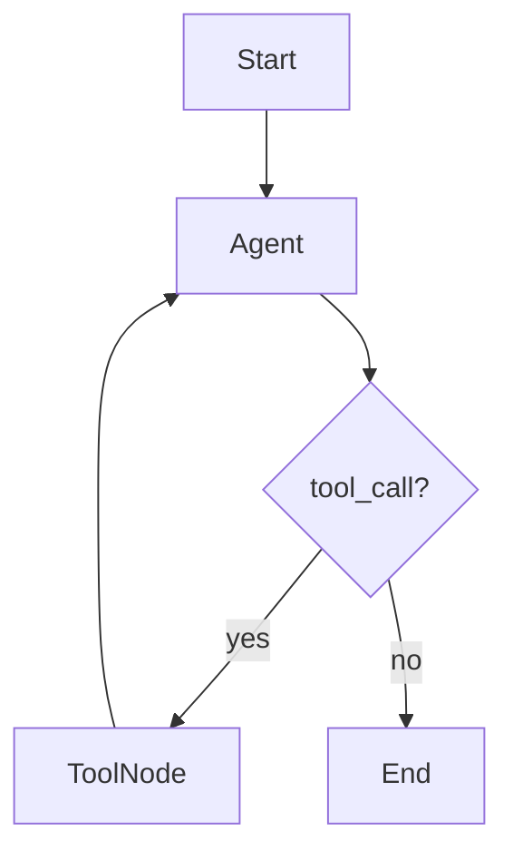

# 系统执行过程详细示例

本文档通过一个**覆盖全事件类型与全工具函数**的复杂任务，逐步展示 Faber API 从接收用户请求到返回最终结果的完整执行过程。

---

## 示例任务

**用户输入：**

> "帮我调研并本地运行 LangGraph 的一个官方示例项目。要求：
> 1. 搜索适合初学者的 LangGraph 示例项目；
> 2. 用浏览器打开 GitHub 仓库找到示例代码入口；
> 3. 把项目克隆到 /tmp/langgraph_demo 并安装依赖；
> 4. 读取项目 README 和配置文件，检查是否需要修复；
> 5. 运行示例，必要时处理交互式提示；
> 6. 如果碰到关键决策点，先问问我；
> 7. 用 MCP 工具生成一张项目架构图；
> 8. 调用远程 Agent 写一段部署总结；
> 9. 把完整调研与部署步骤写成 Markdown 报告保存到 /tmp/langgraph_deploy.md。"

这个任务会自然触发：

- **全部事件类型**：`plan` / `title` / `step` / `message` / `tool` / `wait` / `error` / `done`。
- **全部工具箱**：`search` / `browser` / `file` / `shell` / `message` / `mcp` / `a2a`。
- **几乎全部工具函数**：包括浏览器的点击、输入、滚动、按键、控制台，Shell 的执行、读输出、等待、写输入、终止，文件的读、写、替换、搜索、查找，消息的询问与通知，MCP 与 A2A 的调用等。

---

## 执行流程总览

```
用户发送消息
    ↓
创建 Session（PENDING 状态）
    ↓
PlannerAgent 创建 Plan（PlanEvent CREATED + TitleEvent + MessageEvent）
    ↓
Flow 进入 EXECUTING
    ↓
循环执行每个 Step
    Step 1: 搜索 LangGraph 官方示例项目
        search_web
    Step 2: 浏览器打开 GitHub 仓库，查找示例入口
        browser_navigate → browser_view → browser_click → browser_scroll_down
        → browser_input → browser_press_key → browser_select_option
        → browser_move_mouse → browser_console_exec → browser_console_view
        → browser_scroll_up → browser_restart
    Step 3: 克隆项目并安装依赖
        shell_execute → shell_read_output → shell_wait_process
    Step 4: 读取并修复配置文件
        find_files → read_file → search_in_file → replace_in_file
        某命令失败 → StepEvent FAILED → ErrorEvent → 重试后 COMPLETED
    Step 5: 运行示例并处理交互
        shell_execute → shell_write_input → shell_kill_process → shell_read_output
    Step 6: 询问用户确认
        message_ask_user → MessageEvent + WaitEvent
        用户回复 → roll_back → 继续
    Step 7: 用 MCP 生成架构图
        mcp_diagrammer_generate_mermaid
    Step 8: 调用 A2A 远程 Agent 写部署总结
        get_remote_agent_cards → call_remote_agent
    Step 9: 写入最终 Markdown 报告
        write_file
    ↓
Flow 进入 SUMMARIZING
    ↓
ReAct 汇总所有结果（MessageEvent）
    ↓
Flow 进入 COMPLETED（PlanEvent COMPLETED）
    ↓
返回 DoneEvent
    ↓
前端收到 SSE 事件流
```

---

## 第 1 步：用户请求进入系统

### 1.1 API 接收到请求

用户通过前端或 API 调用：

```bash
POST /api/sessions/{session_id}/chat
Content-Type: application/json

{
  "message": "帮我调研并本地运行 LangGraph 的一个官方示例项目..."
}
```

### 1.2 创建或恢复 Session

文件：`app/interfaces/endpoints/session_routes.py`

```python
session = await session_service.get_or_create(session_id)
```

Session 初始状态：

```python
Session(
    id="session_langgraph_001",
    status=SessionStatus.PENDING,
    title="",
    events=[],
    memories={},
)
```

### 1.3 调用 AgentService.chat()

文件：`app/application/services/agent_service.py`

```python
async def chat(self, session_id: str, message: Optional[str] = None, ...):
    # 1. 检查会话
    # 2. 创建 Task + AgentTaskRunner
    # 3. 先把用户消息作为 MessageEvent(role=user) 持久化并 yield
    # 4. 启动任务并从 output_stream 消费事件
    runner = await self._get_or_create_task_runner(session_id)
    await runner.submit(message)
    async for event in runner.output_stream:
        yield event
```

AgentService 会先生成一个 `MessageEvent(role="user", message=...)` 返回给前端，表示已收到用户消息。

---

## 第 2 步：AgentTaskRunner 启动任务

文件：`app/domain/services/agent_task_runner.py`

### 2.1 初始化

```python
runner = AgentTaskRunner(
    uow_factory=uow_factory,
    llm=llm,
    agent_config=agent_config,
    sandbox=sandbox,
    search_engine=search_engine,
    file_storage=file_storage,
    mcp_config=mcp_config,
    a2a_config=a2a_config,
    ...
)
```

### 2.2 提交用户消息

```python
await runner.submit(message)
```

### 2.3 invoke() 开始执行

```python
async def invoke(self) -> AsyncGenerator[BaseEvent, None]:
    task = Task(input_stream=self.input_stream, output_stream=self.output_stream)
    asyncio.create_task(self._run_flow(task))
    while True:
        event = await task.output_stream.get()
        if event is None:
            break
        # 对截图等附加内容进行 enrich 处理
        yield event
```

---

## 第 3 步：PlannerReActFlow 创建 Plan

### 3.1 Flow 初始状态

```python
flow = PlannerReActFlow(...)
flow.status = FlowStatus.IDLE
```

### 3.2 进入主循环

文件：`app/domain/services/flows/planner_react.py`

```python
async def invoke(self, message: Message):
    await self._uow.session.update_status(self._session_id, SessionStatus.RUNNING)
    self._start_time = time.time()

    while True:
        # 检查任务超时...

        if self.status == FlowStatus.IDLE:
            self.status = FlowStatus.PLANNING

        elif self.status == FlowStatus.PLANNING:
            async for event in self.planner.create_plan(message):
                yield event
            self.status = FlowStatus.EXECUTING
```

### 3.3 PlannerAgent 生成 Plan

PlannerAgent 把下面这个 prompt（`CREATE_PLAN_PROMPT`）发给大模型，其中 `{message}` 被替换为用户的原始消息。

文件：`app/domain/services/prompts/planner.py`

```text
你现在正在根据用户的消息创建一个计划:
{message}

注意：
- **你必须使用用户消息中使用的语言来执行任务**
- 你的计划必须简洁明了，不要添加任何不必要的细节
- 你的步骤必须是原子性且独立的，以便下一个执行者可以使用工具逐一执行它们
- 你需要判断任务是否可以拆分为多个步骤，如果可以，返回多个步骤；否则，返回单个步骤
- **为每个步骤添加 `success_criteria`，描述该步骤完成的具体可验证标准。如果无法明确验收条件，可省略。**

返回格式要求：
- 必须返回符合以下 TypeScript 接口定义的 JSON 格式
- 必须包含指定的所有必填字段
- 如果判定任务不可行, 则"steps"返回空数组，"goal"返回空字符串

TypeScript 接口定义：
```typescript
interface CreatePlanResponse {
  /** 对用户消息的回复以及对任务的思考，尽可能详细，使用用户的语言 **/
  message: string;
  /** 根据用户消息确定的工作语言 **/
  language: string;
  /** 步骤数组，每个步骤包含id和描述 **/
  steps: Array<{
    /** 步骤标识符 **/
    id: string;
    /** 步骤描述 **/
    description: string;
    /** 步骤验收标准：什么情况下算这一步成功完成，可选 **/
    success_criteria?: string;
  }>;
  /** 根据上下文生成的计划目标 **/
  goal: string;
  /** 根据上下文生成的计划标题 **/
  title: string;
}
```

JSON 输出示例:
{
  "message": "用户回复消息",
  "goal": "目标描述",
  "title": "任务标题",
  "language": "zh",
  "steps": [
    {
      "id": "1",
      "description": "步骤1描述",
      "success_criteria": "步骤1完成的具体可验证标准"
    }
  ]
}

输入:
- message: 用户的消息
- attachments: 用户的附件

输出:
- JSON 格式的计划

用户消息:
{message}

附件:
{attachments}
```

实际发送给 LLM 时，`{message}` 被填充为：

> "帮我调研并本地运行 LangGraph 的一个官方示例项目。要求：1. 搜索适合初学者的 LangGraph 示例项目；2. 用浏览器打开 GitHub 仓库找到示例代码入口；3. 把项目克隆到 /tmp/langgraph_demo 并安装依赖；4. 读取项目 README 和配置文件，检查是否需要修复；5. 运行示例，必要时处理交互式提示；6. 如果碰到关键决策点，先问问我；7. 用 MCP 工具生成一张项目架构图；8. 调用远程 Agent 写一段部署总结；9. 把完整调研与部署步骤写成 Markdown 报告保存到 /tmp/langgraph_deploy.md。"

**注意：** 上面只是用户消息部分的 prompt。实际 HTTP 请求中，它前面还会带上 System Prompt（`SYSTEM_PROMPT + PLANNER_SYSTEM_PROMPT`），后面会再带上历史消息。System Prompt 全文见文末「附录 A：System Prompt」。

### 3.4 LLM 返回 Plan

假设 LLM 返回：

```json
{
  "message": "我来帮您调研并本地运行一个 LangGraph 官方示例项目，并整理成部署报告。",
  "language": "zh",
  "goal": "完成 LangGraph 官方示例项目的搜索、克隆、依赖安装、运行、修复、架构图生成、远程 Agent 总结，并输出 Markdown 报告到 /tmp/langgraph_deploy.md",
  "title": "LangGraph 示例项目调研与本地部署",
  "steps": [
    {
      "id": "1",
      "description": "搜索适合初学者的 LangGraph 官方示例项目",
      "success_criteria": "获得至少一个官方示例项目的名称和 GitHub 地址"
    },
    {
      "id": "2",
      "description": "用浏览器打开 GitHub 仓库并定位示例代码入口",
      "success_criteria": "确认示例目录结构和入口文件（如 quick_start.ipynb / app.py）"
    },
    {
      "id": "3",
      "description": "将项目克隆到 /tmp/langgraph_demo 并安装依赖",
      "success_criteria": "仓库已克隆，依赖安装命令成功执行"
    },
    {
      "id": "4",
      "description": "读取 README 和依赖配置，检查并修复潜在问题",
      "success_criteria": "README 已读取，依赖版本问题已被识别并修复"
    },
    {
      "id": "5",
      "description": "运行示例并处理交互式提示",
      "success_criteria": "示例进程启动，交互式提示已正确响应"
    },
    {
      "id": "6",
      "description": "就关键运行参数向用户确认",
      "success_criteria": "获得用户明确回复"
    },
    {
      "id": "7",
      "description": "使用 MCP 工具生成项目架构图",
      "success_criteria": "获得架构图文件或 Mermaid 源码"
    },
    {
      "id": "8",
      "description": "调用 A2A 远程 Agent 生成部署总结",
      "success_criteria": "获得远程 Agent 返回的部署总结文本"
    },
    {
      "id": "9",
      "description": "把调研与部署过程整理成 Markdown 报告写入 /tmp/langgraph_deploy.md",
      "success_criteria": "报告文件存在且包含搜索、克隆、运行、架构图、部署总结等关键内容"
    }
  ]
}
```

### 3.5 生成事件

```python
PlanEvent(
    plan=Plan(
        title="LangGraph 示例项目调研与本地部署",
        goal="完成 LangGraph 官方示例项目的搜索、克隆、依赖安装、运行、修复、架构图生成、远程 Agent 总结，并输出 Markdown 报告到 /tmp/langgraph_deploy.md",
        steps=[...],
    ),
    status=PlanEventStatus.CREATED,
)

TitleEvent(title="LangGraph 示例项目调研与本地部署")
MessageEvent(role="assistant", message="我来帮您调研并本地运行一个 LangGraph 官方示例项目，并整理成部署报告。")
```

这些事件被持久化到 PostgreSQL，并通过 SSE 推送给前端。

---

## 第 4 步：执行 Step 1 — 搜索项目信息

### 4.1 Flow 进入 EXECUTING

```python
self.status = FlowStatus.EXECUTING
step = self.plan.get_next_step()  # Step 1
```

同时生成 `StepEvent(status=STARTED)`。

### 4.2 ReActAgent.execute_step() 构建上下文

```python
plan_context = {
    "goal": "完成 LangGraph 官方示例项目的搜索、克隆、依赖安装、运行、修复、架构图生成、远程 Agent 总结...",
    "title": "LangGraph 示例项目调研与本地部署",
    "current_step": "搜索适合初学者的 LangGraph 官方示例项目",
    "completed_steps": "无",
    "remaining_steps": "- [待执行] 用浏览器打开 GitHub 仓库...\n- [待执行] 将项目克隆...",
    "current_step_index": 1,
    "total_steps": 9,
}
```

### 4.3 EXECUTION_PROMPT 内容

ReActAgent 把下面这个 prompt（`EXECUTION_PROMPT`）发给大模型。其中 `{title}`、`{goal}`、`{current_step_index}`、`{total_steps}`、`{completed_steps}`、`{remaining_steps}`、`{step}`、`{success_criteria}`、`{message}` 等变量会被 `plan_context` 和原始消息填充。

文件：`app/domain/services/prompts/react.py`

```text
你正在执行一个多步骤任务中的一部分。在执行当前步骤时，请始终牢记全局目标，不要偏离主线。

=== 任务全局上下文 ===
任务标题: {title}
任务目标: {goal}
总进度: {current_step_index} / {total_steps}
已完成步骤:
{completed_steps}
待执行步骤:
{remaining_steps}
====================

你正在执行的任务：
{step}

验收标准：
{success_criteria}

注意事项：
- **是你来执行这个任务，而不是用户。**不要告诉用户“如何做”，而是直接通过工具“去做”。
- **必须使用用户消息中使用的语言（Working Language）来执行任务和回复。**
- 当前步骤应服务于全局目标。如果当前步骤的结果已经偏离全局目标，请主动修正或调用 `message_ask_user` 向用户确认。
- 执行完成后，请对照「验收标准」自我验证。如果验收标准已满足，在 result 中明确说明。
- 必须使用 `message_notify_user` 工具向用户通报进度，内容限制在一句话以内：
    - 你打算使用什么工具，以及用它做什么；
    - 或者你通过工具完成了什么；
    - 简明扼要地告知当前动作。
- 如果你需要用户提供输入或需要获取浏览器的控制权，必须使用 `message_ask_user` 工具向用户提问。
- 再次强调：直接交付最终结果，而不是提供待办事项列表、建议或计划。

返回格式要求：
- 必须返回符合以下 TypeScript 接口定义的 JSON 格式。
- 必须包含所有指定的必填字段。

TypeScript 接口定义：
```typescript
interface Response {
  /** 任务步骤是否成功执行 **/
  success: boolean;
  /** 沙箱中需要交付给用户的生成文件的路径数组 **/
  attachments: string[];

  /** 任务结果文本，如果没有结果需要交付则留空 **/
  result: string;
}
```

JSON 输出示例：
{
    "success": true,
    "result": "我们已经完成了数据清洗任务，并生成了摘要。",
    "attachments": [
        "/home/ubuntu/file1.md",
        "/home/ubuntu/file2.md"
    ]
}

输入信息：
- message: 用户消息（请在所有文本输出中使用此语言）
- attachments: 用户提供的附件
- language: 当前的工作语言
- task: 当前需要执行的任务

输出：
- JSON 格式的步骤执行结果

用户消息(message):
{message}

附件(attachments):
{attachments}

工作语言(language):
{language}

任务(task):
{step}
```

填充 Step 1 的 `plan_context` 后，实际发送给 LLM 的 prompt 开头如下：

```text
你正在执行一个多步骤任务中的一部分。在执行当前步骤时，请始终牢记全局目标，不要偏离主线。

=== 任务全局上下文 ===
任务标题: LangGraph 示例项目调研与本地部署
任务目标: 完成 LangGraph 官方示例项目的搜索、克隆、依赖安装、运行、修复、架构图生成、远程 Agent 总结，并输出 Markdown 报告到 /tmp/langgraph_deploy.md
总进度: 1 / 9
已完成步骤:
无
待执行步骤:
- [待执行] 用浏览器打开 GitHub 仓库并定位示例代码入口
- [待执行] 将项目克隆到 /tmp/langgraph_demo 并安装依赖
- [待执行] 读取 README 和依赖配置，检查并修复潜在问题
- [待执行] 运行示例并处理交互式提示
- [待执行] 就关键运行参数向用户确认
- [待执行] 使用 MCP 工具生成项目架构图
- [待执行] 调用 A2A 远程 Agent 生成部署总结
- [待执行] 把调研与部署过程整理成 Markdown 报告写入 /tmp/langgraph_deploy.md
====================

你正在执行的任务：
搜索适合初学者的 LangGraph 官方示例项目

验收标准：
获得至少一个官方示例项目的名称和 GitHub 地址

注意事项：
...
```

后续 Step 2 ~ Step 9 都会复用同一个 `EXECUTION_PROMPT` 模板，只有 `plan_context` 和 `{step}` / `{success_criteria}` 不同。

**注意：** 该 prompt 同样会前置 `SYSTEM_PROMPT + REACT_SYSTEM_PROMPT`，并带上历史消息。System Prompt 全文见「附录 A：System Prompt」。

### 4.4 调用 search_web

LLM 决定：

```json
{
  "tool_calls": [
    {
      "function": {
        "name": "search_web",
        "arguments": "{\"query\": \"LangGraph official examples tutorial beginner GitHub\", \"date_range\": \"past_year\"}"
      }
    }
  ]
}
```

事件流：

```python
ToolEvent(
    tool_call_id="call_001",
    tool_name="search",
    function_name="search_web",
    function_args={"query": "LangGraph official examples tutorial beginner GitHub", "date_range": "past_year"},
    status=ToolEventStatus.CALLING,
)
ToolEvent(
    tool_call_id="call_001",
    tool_name="search",
    function_name="search_web",
    function_args={...},
    function_result=ToolResult(...),
    tool_content=SearchToolContent(results=[...]),
    status=ToolEventStatus.CALLED,
)
```

### 4.5 Step 1 完成

```python
StepEvent(step=step, status=StepEventStatus.COMPLETED)
MessageEvent(role="assistant", message="已找到官方示例项目：langgraph-example（https://github.com/langchain-ai/langgraph-example）。")
PlanEvent(plan=plan, status=PlanEventStatus.UPDATED)
```

### 4.6 Planner 更新 Plan 的 Prompt

每个 Step 完成后，PlannerAgent 会调用 `update_plan`，把下面这个 prompt（`UPDATE_PLAN_PROMPT`）发给大模型：

文件：`app/domain/services/prompts/planner.py`

```text
你正在更新计划，你需要根据步骤的执行结果来更新计划：
{step}

注意：
- 你可以删除、添加或者修改计划步骤，但不要改变计划目标 (goal)
- 如果变动不大，不要修改描述
- 仅重新规划后续**未完成**的步骤，不要更改已完成的步骤
- 输出的步骤 ID 应以第一个未完成步骤的 ID 开始，重新规划其后的步骤
- 如果步骤已完成或者不再必要，请将其删除
- 仔细阅读步骤结果以确定是否成功，如果不成功，请更改后续步骤
- 根据步骤结果，你需要相应地更新计划步骤
- **为更新的步骤保留或补充 `success_criteria`，描述该步骤完成的具体可验证标准**

返回格式要求：
- 必须返回符合以下 TypeScript 接口定义的 JSON 格式
- 必须包含指定的所有必填字段

TypeScript接口定义：
```typescript
interface UpdatePlanResponse {
  /** 更新后的未完成步骤数组 **/
  steps: Array<{
    /** 步骤标识符 **/
    id: string;
    /** 步骤描述 **/
    description: string;
    /** 步骤验收标准，可选 **/
    success_criteria?: string;
  }>;
}
```

JSON输出示例：
{
  "steps": [
    {
      "id": "1",
      "description": "步骤1描述",
      "success_criteria": "步骤1完成的具体可验证标准"
    }
  ]
}

输入:
- step: 当前的步骤
- plan: 待更新的计划

输出:
- JSON 格式的更新后的未完成步骤

步骤 (step):
{step}

计划 (plan):
{plan}
```

Step 1 成功后，填充的 `{step}` 是 Step 1 的执行结果，`{plan}` 是完整计划。LLM 返回更新后的剩余 8 个步骤。后续 Step 2 ~ Step 9 每次完成都会复用此 prompt。

---

## 第 5 步：执行 Step 2 — 浏览器查找示例入口

### 5.1 本次 Step 的 plan_context 与 Prompt

进入 Step 2 后，`EXECUTION_PROMPT` 模板不变，但 `plan_context` 更新为：

```python
plan_context = {
    "goal": "完成 LangGraph 官方示例项目的搜索、克隆、依赖安装、运行、修复、架构图生成、远程 Agent 总结...",
    "title": "LangGraph 示例项目调研与本地部署",
    "current_step": "用浏览器打开 GitHub 仓库并定位示例代码入口",
    "completed_steps": "- [完成] 搜索适合初学者的 LangGraph 官方示例项目",
    "remaining_steps": "- [待执行] 将项目克隆到 /tmp/langgraph_demo 并安装依赖\n- [待执行] 读取 README 和依赖配置，检查并修复潜在问题\n- [待执行] 运行示例并处理交互式提示\n- [待执行] 就关键运行参数向用户确认\n- [待执行] 使用 MCP 工具生成项目架构图\n- [待执行] 调用 A2A 远程 Agent 生成部署总结\n- [待执行] 把调研与部署过程整理成 Markdown 报告写入 /tmp/langgraph_deploy.md",
    "current_step_index": 2,
    "total_steps": 9,
}
```

因此，本次发给 LLM 的 prompt 中「总进度」为 `2 / 9`，「你正在执行的任务」为「用浏览器打开 GitHub 仓库并定位示例代码入口」，验收标准也同步更新。

### 5.2 打开 GitHub 仓库

LLM 调用：

```json
{
  "tool_calls": [
    {
      "function": {
        "name": "browser_navigate",
        "arguments": "{\"url\": \"https://github.com/langchain-ai/langgraph-example\"}"
      }
    }
  ]
}
```

对应 `ToolEvent(CALLING)` + `ToolEvent(CALLED)`。

### 5.3 查看页面内容

```json
{
  "tool_calls": [
    {
      "function": {
        "name": "browser_view",
        "arguments": "{}"
      }
    }
  ]
}
```

页面 Markdown 被返回给 LLM，里面包含文件列表。

### 5.4 滚动、点击、输入等浏览器操作

LLM 为了找到 `app.py` 入口，可能执行一系列浏览器工具：

| 调用顺序 | 工具函数 | 作用 |
|---|---|---|
| 1 | `browser_scroll_down` | 向下滚动查看 README |
| 2 | `browser_click` (index) | 点击 "README.md" |
| 3 | `browser_input` | 在搜索框输入 `app.py` 并回车 |
| 4 | `browser_press_key` | 按 Enter / ArrowDown |
| 5 | `browser_move_mouse` | 移动鼠标到某元素 |
| 6 | `browser_select_option` | 在下拉菜单选择分支 |
| 7 | `browser_console_exec` | 执行 JS 获取仓库结构 |
| 8 | `browser_console_view` | 查看控制台输出 |
| 9 | `browser_scroll_up` | 回到页面顶部 |
| 10 | `browser_restart` | 重置浏览器并重新打开仓库 |

每次调用都会产生一对 `ToolEvent(CALLING)` / `ToolEvent(CALLED)`。如果页面被截图，`ToolEvent.tool_content` 会附带 `BrowserToolContent(screenshot=...)`，AgentTaskRunner 还可能把截图上传到 OSS 并在事件中替换为 URL。

### 5.5 反思检查点（Reflection Prompt）

`BaseAgent` 在工具循环中每 `reflection_interval` 轮会暂停，把下面这个反思 prompt 作为 user message 插入对话，让 LLM 自检是否跑偏：

文件：`app/domain/services/prompts/react.py`

```text
=== 执行反思检查点 ===
你正在执行一个多步骤任务。请暂停当前操作，快速回顾并反思：

任务标题: {title}
任务目标: {goal}
当前进度: 第 {current_step_index} / {total_steps} 步
当前步骤: {current_step_description}

已完成步骤:
{completed_steps}

待执行步骤:
{remaining_steps}

请回答以下问题（尽量简洁，不超过3句话）：
1. 我当前的操作是否仍然对齐原始目标？
2. 我是否陷入了不必要的细节或重复尝试？
3. 下一步应该做什么才能最高效地推进任务？
4. 根据当前已收集的结果，任务目标是否已提前达成？
   如果已达成，请在后续回复中直接输出最终结果（可包含 `[EARLY_COMPLETE]` 标记），不再调用工具。

回答完成后，继续执行你认为最合适的下一个工具调用。
====================
```

在 Step 2 中，假设浏览器操作较多，在第 5 轮工具调用后触发反思。填充后的 prompt 示例：

```text
=== 执行反思检查点 ===
你正在执行一个多步骤任务。请暂停当前操作，快速回顾并反思：

任务标题: LangGraph 示例项目调研与本地部署
任务目标: 完成 LangGraph 官方示例项目的搜索、克隆、依赖安装、运行、修复、架构图生成、远程 Agent 总结...
当前进度: 第 2 / 9 步
当前步骤: 用浏览器打开 GitHub 仓库并定位示例代码入口

已完成步骤:
- [完成] 搜索适合初学者的 LangGraph 官方示例项目

待执行步骤:
- [待执行] 将项目克隆到 /tmp/langgraph_demo 并安装依赖
- [待执行] 读取 README 和依赖配置，检查并修复潜在问题
...

请回答以下问题（尽量简洁，不超过3句话）：
...
====================
```

LLM 反思后确认「仍在查找 app.py 入口，没有跑偏」，然后继续调用 `browser_console_exec`。

### 5.6 Step 2 完成

```python
StepEvent(step=step, status=StepEventStatus.COMPLETED)
MessageEvent(role="assistant", message="已确认示例入口为 app.py，依赖文件为 requirements.txt。")
PlanEvent(plan=plan, status=PlanEventStatus.UPDATED)
```

---

## 第 6 步：执行 Step 3 — 克隆项目并安装依赖

### 6.1 本次 Step 的 plan_context 与 Prompt

进入 Step 3 后，`plan_context` 再次更新：

```python
plan_context = {
    "completed_steps": "- [完成] 搜索适合初学者的 LangGraph 官方示例项目\n- [完成] 用浏览器打开 GitHub 仓库并定位示例代码入口",
    "remaining_steps": "- [待执行] 读取 README 和依赖配置，检查并修复潜在问题\n- [待执行] 运行示例并处理交互式提示\n- [待执行] 就关键运行参数向用户确认\n- [待执行] 使用 MCP 工具生成项目架构图\n- [待执行] 调用 A2A 远程 Agent 生成部署总结\n- [待执行] 把调研与部署过程整理成 Markdown 报告写入 /tmp/langgraph_deploy.md",
    "current_step_index": 3,
    "total_steps": 9,
}
```

### 6.2 克隆仓库

LLM 调用：

```json
{
  "tool_calls": [
    {
      "function": {
        "name": "shell_execute",
        "arguments": "{\"session_id\": \"shell_001\", \"exec_dir\": \"/tmp\", \"command\": \"git clone https://github.com/langchain-ai/langgraph-example.git langgraph_demo\"}"
      }
    }
  ]
}
```

### 6.3 读取输出

```json
{
  "tool_calls": [
    {
      "function": {
        "name": "shell_read_output",
        "arguments": "{\"session_id\": \"shell_001\"}"
      }
    }
  ]
}
```

### 6.4 安装依赖

```json
{
  "tool_calls": [
    {
      "function": {
        "name": "shell_execute",
        "arguments": "{\"session_id\": \"shell_001\", \"exec_dir\": \"/tmp/langgraph_demo\", \"command\": \"pip install -r requirements.txt\"}"
      }
    }
  ]
}
```

### 6.5 等待进程

```json
{
  "tool_calls": [
    {
      "function": {
        "name": "shell_wait_process",
        "arguments": "{\"session_id\": \"shell_001\", \"seconds\": 30}"
      }
    }
  ]
}
```

### 6.6 Step 3 完成

```python
StepEvent(step=step, status=StepEventStatus.COMPLETED)
MessageEvent(role="assistant", message="项目已克隆到 /tmp/langgraph_demo，依赖安装中。")
PlanEvent(plan=plan, status=PlanEventStatus.UPDATED)
```

---

## 第 7 步：执行 Step 4 — 读取并修复配置文件

### 7.1 本次 Step 的 plan_context 与 Prompt

进入 Step 4 后，`plan_context` 更新为：

```python
plan_context = {
    "completed_steps": "- [完成] 搜索适合初学者的 LangGraph 官方示例项目\n- [完成] 用浏览器打开 GitHub 仓库并定位示例代码入口\n- [完成] 将项目克隆到 /tmp/langgraph_demo 并安装依赖",
    "remaining_steps": "- [待执行] 运行示例并处理交互式提示\n- [待执行] 就关键运行参数向用户确认\n- [待执行] 使用 MCP 工具生成项目架构图\n- [待执行] 调用 A2A 远程 Agent 生成部署总结\n- [待执行] 把调研与部署过程整理成 Markdown 报告写入 /tmp/langgraph_deploy.md",
    "current_step_index": 4,
    "total_steps": 9,
}
```

### 7.2 查找项目文件

```json
{
  "tool_calls": [
    {
      "function": {
        "name": "find_files",
        "arguments": "{\"dir_path\": \"/tmp/langgraph_demo\", \"glob_pattern\": \"*.py\"}"
      }
    }
  ]
}
```

### 7.3 读取 README

```json
{
  "tool_calls": [
    {
      "function": {
        "name": "read_file",
        "arguments": "{\"filepath\": \"/tmp/langgraph_demo/README.md\"}"
      }
    }
  ]
}
```

### 7.4 读取 requirements.txt

```json
{
  "tool_calls": [
    {
      "function": {
        "name": "read_file",
        "arguments": "{\"filepath\": \"/tmp/langgraph_demo/requirements.txt\"}"
      }
    }
  ]
}
```

### 7.5 搜索特定依赖版本

```json
{
  "tool_calls": [
    {
      "function": {
        "name": "search_in_file",
        "arguments": "{\"filepath\": \"/tmp/langgraph_demo/requirements.txt\", \"regex\": \"langgraph==\\d+\\.\\d+\\.\\d+\"}"
      }
    }
  ]
}
```

### 7.6 修复版本（replace_in_file）

发现 `langgraph==0.0.29` 太旧，LLM 决定替换为较新版本：

```json
{
  "tool_calls": [
    {
      "function": {
        "name": "replace_in_file",
        "arguments": "{\"filepath\": \"/tmp/langgraph_demo/requirements.txt\", \"old_str\": \"langgraph==0.0.29\", \"new_str\": \"langgraph>=0.2.0\"}"
      }
    }
  ]
}
```

### 7.7 Step 4 中的失败与 ErrorEvent

假设在首次验证时，Agent 运行 `python app.py --check` 发现语法错误：

```python
ToolEvent(
    tool_call_id="call_xxx",
    tool_name="shell",
    function_name="shell_execute",
    status=ToolEventStatus.CALLED,
    function_result=ToolResult(success=False, message="SyntaxError: invalid syntax in app.py line 42"),
)

StepEvent(step=step, status=StepEventStatus.FAILED)
ErrorEvent(error="Step 4 验证失败：app.py 存在语法错误。")
```

防跑偏机制会让 Planner 重新评估并生成修复子步骤，LLM 用 `replace_in_file` 修复语法错误后再次验证，最终：

```python
StepEvent(step=step, status=StepEventStatus.COMPLETED)
PlanEvent(plan=plan, status=PlanEventStatus.UPDATED)
```

---

## 第 8 步：执行 Step 5 — 运行示例并处理交互

### 8.1 本次 Step 的 plan_context 与 Prompt

进入 Step 5 后，`plan_context` 更新为：

```python
plan_context = {
    "completed_steps": "- [完成] 搜索适合初学者的 LangGraph 官方示例项目\n- [完成] 用浏览器打开 GitHub 仓库并定位示例代码入口\n- [完成] 将项目克隆到 /tmp/langgraph_demo 并安装依赖\n- [完成] 读取 README 和依赖配置，检查并修复潜在问题",
    "remaining_steps": "- [待执行] 就关键运行参数向用户确认\n- [待执行] 使用 MCP 工具生成项目架构图\n- [待执行] 调用 A2A 远程 Agent 生成部署总结\n- [待执行] 把调研与部署过程整理成 Markdown 报告写入 /tmp/langgraph_deploy.md",
    "current_step_index": 5,
    "total_steps": 9,
}
```

### 8.2 启动示例进程

```json
{
  "tool_calls": [
    {
      "function": {
        "name": "shell_execute",
        "arguments": "{\"session_id\": \"shell_002\", \"exec_dir\": \"/tmp/langgraph_demo\", \"command\": \"python app.py\"}"
      }
    }
  ]
}
```

### 8.3 进程等待交互提示

```json
{
  "tool_calls": [
    {
      "function": {
        "name": "shell_wait_process",
        "arguments": "{\"session_id\": \"shell_002\", \"seconds\": 5}"
      }
    }
  ]
}
```

### 8.4 读取输出发现提示

```json
{
  "tool_calls": [
    {
      "function": {
        "name": "shell_read_output",
        "arguments": "{\"session_id\": \"shell_002\"}"
      }
    }
  ]
}
```

输出显示：`Please enter your OpenAI API key:`

### 8.5 写入输入

```json
{
  "tool_calls": [
    {
      "function": {
        "name": "shell_write_input",
        "arguments": "{\"session_id\": \"shell_002\", \"input_text\": \"sk-xxxxxxxx\", \"press_enter\": true}"
      }
    }
  ]
}
```

### 8.6 示例运行一段时间后终止

```json
{
  "tool_calls": [
    {
      "function": {
        "name": "shell_kill_process",
        "arguments": "{\"session_id\": \"shell_002\"}"
      }
    }
  ]
}
```

### 8.7 Step 5 完成

```python
StepEvent(step=step, status=StepEventStatus.COMPLETED)
MessageEvent(role="assistant", message="示例已成功运行并响应交互式输入。")
PlanEvent(plan=plan, status=PlanEventStatus.UPDATED)
```

---

## 第 9 步：执行 Step 6 — 询问用户确认

### 9.1 本次 Step 的 plan_context 与 Prompt

进入 Step 6 后，`plan_context` 更新为：

```python
plan_context = {
    "completed_steps": "- [完成] 搜索适合初学者的 LangGraph 官方示例项目\n- [完成] 用浏览器打开 GitHub 仓库并定位示例代码入口\n- [完成] 将项目克隆到 /tmp/langgraph_demo 并安装依赖\n- [完成] 读取 README 和依赖配置，检查并修复潜在问题\n- [完成] 运行示例并处理交互式提示",
    "remaining_steps": "- [待执行] 使用 MCP 工具生成项目架构图\n- [待执行] 调用 A2A 远程 Agent 生成部署总结\n- [待执行] 把调研与部署过程整理成 Markdown 报告写入 /tmp/langgraph_deploy.md",
    "current_step_index": 6,
    "total_steps": 9,
}
```

### 9.2 触发 ask_user

在 Step 6，Agent 需要确认是否把示例中的默认 LLM 模型从 `gpt-3.5-turbo` 改为 `gpt-4o`，于是调用：

```json
{
  "tool_calls": [
    {
      "function": {
        "name": "message_ask_user",
        "arguments": "{\"text\": \"检测到示例默认使用 gpt-3.5-turbo。是否需要我把它升级为 gpt-4o 以获得更好的效果？\", \"suggest_user_takeover\": \"none\"}"
      }
    }
  ]
}
```

### 9.3 ReActAgent 处理 message_ask_user

文件：`app/domain/services/agents/react.py`

```python
if event.function_name == "message_ask_user":
    if event.status == ToolEventStatus.CALLING:
        yield MessageEvent(
            role="assistant",
            message=event.function_args.get("text", "")
        )
    elif event.status == ToolEventStatus.CALLED:
        yield WaitEvent()
        return
```

### 9.4 前端收到的事件

```json
{"type": "tool", "status": "calling", "function": "message_ask_user", ...}
{"type": "message", "role": "assistant", "message": "检测到示例默认使用 gpt-3.5-turbo。是否需要我把它升级为 gpt-4o..."}
{"type": "tool", "status": "called", "function": "message_ask_user", ...}
{"type": "wait"}
```

### 9.5 Session 进入 WAITING 状态

AgentService 收到 `WaitEvent` 后更新 Session：

```python
await self._uow.session.update_status(session_id, SessionStatus.WAITING)
```

SSE 流暂停，前端展示问题。

### 9.6 用户回复并恢复执行

用户回复：

```bash
POST /api/sessions/{session_id}/chat
{
  "message": "改成 gpt-4o 吧"
}
```

Flow 再次进入 `invoke()`：

```python
if session.status == SessionStatus.WAITING:
    self.status = FlowStatus.EXECUTING

await self.planner.roll_back(message)
await self.react.roll_back(message)
# roll_back 把用户回复作为 tool 结果插入记忆
```

然后继续完成 Step 6。

---

## 第 10 步：执行 Step 7 — 调用 MCP 生成架构图

### 10.1 本次 Step 的 plan_context 与 Prompt

进入 Step 7 后，`plan_context` 更新为：

```python
plan_context = {
    "completed_steps": "- [完成] 搜索适合初学者的 LangGraph 官方示例项目\n- [完成] 用浏览器打开 GitHub 仓库并定位示例代码入口\n- [完成] 将项目克隆到 /tmp/langgraph_demo 并安装依赖\n- [完成] 读取 README 和依赖配置，检查并修复潜在问题\n- [完成] 运行示例并处理交互式提示\n- [完成] 就关键运行参数向用户确认",
    "remaining_steps": "- [待执行] 调用 A2A 远程 Agent 生成部署总结\n- [待执行] 把调研与部署过程整理成 Markdown 报告写入 /tmp/langgraph_deploy.md",
    "current_step_index": 7,
    "total_steps": 9,
}
```

### 10.2 先通知用户

在调用 MCP 之前，Agent 先发送一个无需回复的通知：

```json
{
  "tool_calls": [
    {
      "function": {
        "name": "message_notify_user",
        "arguments": "{\"text\": \"正在调用 MCP 工具生成项目架构图...\"}"
      }
    }
  ]
}
```

`message_notify_user` 立即返回 `ToolResult(success=True, data="Continue")`，并产生：

```python
ToolEvent(tool_name="message", function_name="message_notify_user", status=ToolEventStatus.CALLING)
ToolEvent(tool_name="message", function_name="message_notify_user", status=ToolEventStatus.CALLED)
```

### 10.3 调用 MCP 工具

假设配置了一个名为 `diagrammer` 的 MCP 服务器，提供 `generate_mermaid` 工具：

```json
{
  "tool_calls": [
    {
      "function": {
        "name": "mcp_diagrammer_generate_mermaid",
        "arguments": "{\"source\": \"LangGraph StateGraph with nodes: agent, tools, conditional_edge; edges: start->agent, agent->tools (tool_call), tools->agent, agent->end\"}"
      }
    }
  ]
}
```

### 10.4 MCP 工具事件

```python
ToolEvent(
    tool_call_id="call_mcp_001",
    tool_name="mcp",
    function_name="mcp_diagrammer_generate_mermaid",
    function_args={"source": "..."},
    status=ToolEventStatus.CALLING,
)
ToolEvent(
    tool_call_id="call_mcp_001",
    tool_name="mcp",
    function_name="mcp_diagrammer_generate_mermaid",
    function_result=ToolResult(success=True, data="```mermaid\ngraph TD;...\n```"),
    tool_content=MCPToolContent(result="```mermaid\ngraph TD;...\n```"),
    status=ToolEventStatus.CALLED,
)
```

### 10.5 Step 7 完成

```python
StepEvent(step=step, status=StepEventStatus.COMPLETED)
MessageEvent(role="assistant", message="已使用 MCP 工具生成项目架构图。")
PlanEvent(plan=plan, status=PlanEventStatus.UPDATED)
```

---

## 第 11 步：执行 Step 8 — 调用 A2A 远程 Agent

### 11.1 本次 Step 的 plan_context 与 Prompt

进入 Step 8 后，`plan_context` 更新为：

```python
plan_context = {
    "completed_steps": "- [完成] 搜索适合初学者的 LangGraph 官方示例项目\n- [完成] 用浏览器打开 GitHub 仓库并定位示例代码入口\n- [完成] 将项目克隆到 /tmp/langgraph_demo 并安装依赖\n- [完成] 读取 README 和依赖配置，检查并修复潜在问题\n- [完成] 运行示例并处理交互式提示\n- [完成] 就关键运行参数向用户确认\n- [完成] 使用 MCP 工具生成项目架构图",
    "remaining_steps": "- [待执行] 把调研与部署过程整理成 Markdown 报告写入 /tmp/langgraph_deploy.md",
    "current_step_index": 8,
    "total_steps": 9,
}
```

### 11.2 获取远程 Agent 卡片

```json
{
  "tool_calls": [
    {
      "function": {
        "name": "get_remote_agent_cards",
        "arguments": "{}"
      }
    }
  ]
}
```

返回一个名为 `deploy-writer` 的远程 Agent。

### 11.3 调用远程 Agent

```json
{
  "tool_calls": [
    {
      "function": {
        "name": "call_remote_agent",
        "arguments": "{\"id\": \"deploy-writer\", \"query\": \"请根据以下信息写一段 LangGraph 示例项目的部署总结：项目地址 https://github.com/langchain-ai/langgraph-example，入口 app.py，依赖 langgraph>=0.2.0，运行时需要输入 OpenAI API key，默认模型可升级为 gpt-4o。\"}"
      }
    }
  ]
}
```

### 11.4 A2A 工具事件

```python
ToolEvent(
    tool_call_id="call_a2a_001",
    tool_name="a2a",
    function_name="call_remote_agent",
    function_result=ToolResult(success=True, data={"result": "部署总结文本..."}),
    tool_content=A2AToolContent(a2a_result={"result": "部署总结文本..."}),
    status=ToolEventStatus.CALLED,
)
```

### 11.5 Step 8 完成

```python
StepEvent(step=step, status=StepEventStatus.COMPLETED)
MessageEvent(role="assistant", message="已调用远程 Agent 生成部署总结。")
PlanEvent(plan=plan, status=PlanEventStatus.UPDATED)
```

---

## 第 12 步：执行 Step 9 — 写入最终报告

### 12.1 本次 Step 的 plan_context 与 Prompt

进入 Step 9 后，`plan_context` 更新为：

```python
plan_context = {
    "completed_steps": "- [完成] 搜索适合初学者的 LangGraph 官方示例项目\n- [完成] 用浏览器打开 GitHub 仓库并定位示例代码入口\n- [完成] 将项目克隆到 /tmp/langgraph_demo 并安装依赖\n- [完成] 读取 README 和依赖配置，检查并修复潜在问题\n- [完成] 运行示例并处理交互式提示\n- [完成] 就关键运行参数向用户确认\n- [完成] 使用 MCP 工具生成项目架构图\n- [完成] 调用 A2A 远程 Agent 生成部署总结",
    "remaining_steps": "无",
    "current_step_index": 9,
    "total_steps": 9,
}
```

### 12.2 构建 Markdown 报告

LLM 汇总前面的所有结果，生成报告：

```markdown
# LangGraph 示例项目调研与本地部署报告

## 1. 项目信息

- 仓库：https://github.com/langchain-ai/langgraph-example
- 克隆路径：/tmp/langgraph_demo
- 入口文件：app.py

## 2. 依赖与修复

- 原 requirements.txt 中 langgraph==0.0.29 已替换为 langgraph>=0.2.0。
- 修复了 app.py  line 42 的语法错误。

## 3. 运行方式

```bash
cd /tmp/langgraph_demo
pip install -r requirements.txt
python app.py
# 按提示输入 OpenAI API key
```

## 4. 架构图



## 5. 部署总结

（来自 A2A 远程 Agent deploy-writer）

该项目适合作为 LangGraph 入门示例，建议在生产环境中...

## 6. 用户确认记录

- 用户同意将默认模型从 gpt-3.5-turbo 升级为 gpt-4o。
```

### 12.3 调用 write_file

```json
{
  "tool_calls": [
    {
      "function": {
        "name": "write_file",
        "arguments": "{\"filepath\": \"/tmp/langgraph_deploy.md\", \"content\": \"# LangGraph 示例项目调研与本地部署报告\\n...\"}"
      }
    }
  ]
}
```

### 12.4 Step 9 完成

```python
StepEvent(step=step, status=StepEventStatus.COMPLETED)
MessageEvent(
    role="assistant",
    message="报告已保存到 /tmp/langgraph_deploy.md。",
    attachments=[File(filepath="/tmp/langgraph_deploy.md")],
)
PlanEvent(plan=plan, status=PlanEventStatus.UPDATED)
```

---

## 第 13 步：Flow 进入 SUMMARIZING

### 13.1 所有 Steps 完成

```python
step = self.plan.get_next_step()  # None
self.status = FlowStatus.SUMMARIZING
```

### 13.2 ReActAgent.summarize() 的 Prompt

所有 Step 完成后，ReActAgent 调用 `summarize()`，把下面这个 prompt（`SUMMARIZE_PROMPT`）发给大模型。此时记忆（Memory）中已包含完整的用户消息、计划、工具结果和步骤结果，LLM 基于这些上下文生成最终回复。

**注意：** 该 prompt 同样会前置 `SYSTEM_PROMPT + REACT_SYSTEM_PROMPT`，并带上历史消息。System Prompt 全文见「附录 A：System Prompt」。

文件：`app/domain/services/prompts/react.py`

```text
任务已完成，你需要将最终结果交付给用户。

注意事项：
- 你应该详细向用户解释最终结果。
- 如有必要，编写 Markdown 格式的内容以清晰地呈现结果。
- 如果之前的步骤生成了文件，必须通过文件工具或附件字段交付给用户。

返回格式要求：
- 必须返回符合以下 TypeScript 接口定义的 JSON 格式。
- 必须包含所有指定的必填字段。

TypeScript 接口定义：
```typescript
interface Response {
  /** 对用户消息的回复以及关于任务的总结思考，越详细越好 */
  message: string;
  /** 沙箱中生成的、需要交付给用户的文件路径数组 */
  attachments: string[];
}
```

JSON 输出示例：
{
    "message": "任务已完成。我已经为您处理了所有数据，主要发现如下：\n1. 增长率...\n2. 异常值...\n详细报告请查看附件。",
    "attachments": [
        "/home/ubuntu/report.md",
        "/home/ubuntu/data.csv"
    ]
}
```

代码调用：

```python
async def summarize(self):
    query = SUMMARIZE_PROMPT
    async for event in self.invoke(query):
        if isinstance(event, MessageEvent):
            parsed_obj = await self._json_parser.invoke(event.message)
            message = Message.model_validate(parsed_obj)
            yield MessageEvent(
                role="assistant",
                message=message.message,
                attachments=[File(filepath=f) for f in message.attachments],
            )
```

### 13.3 LLM 生成最终回复

```json
{
  "message": "已完成 LangGraph 示例项目的调研与本地部署。\n\n主要成果：\n- 项目已克隆到 /tmp/langgraph_demo\n- 依赖已修复并安装\n- 示例可运行，已处理 API key 交互\n- 已按您的要求将模型升级为 gpt-4o\n- 已用 MCP 生成架构图\n- 已调用远程 Agent 生成部署总结\n- 完整报告已保存到 /tmp/langgraph_deploy.md",
  "attachments": ["/tmp/langgraph_deploy.md"]
}
```

---

## 第 14 步：任务完成

### 14.1 Flow 进入 COMPLETED

```python
self.status = FlowStatus.COMPLETED
self.plan.status = ExecutionStatus.COMPLETED
yield PlanEvent(status=PlanEventStatus.COMPLETED, plan=self.plan)
```

### 14.2 生成 DoneEvent

```python
yield DoneEvent()
```

### 14.3 Session 状态更新

```python
Session(
    id="session_langgraph_001",
    status=SessionStatus.COMPLETED,
    title="LangGraph 示例项目调研与本地部署",
    events=[
        MessageEvent(user), PlanEvent(CREATED), TitleEvent, MessageEvent(assistant),
        StepEvent(STARTED), ToolEvent(CALLING/CALLED), StepEvent(COMPLETED),
        PlanEvent(UPDATED), ..., StepEvent(FAILED), ErrorEvent,
        WaitEvent, PlanEvent(COMPLETED), MessageEvent(final), DoneEvent
    ],
)
```

所有事件被持久化到 PostgreSQL。

---

## 第 15 步：前端收到 SSE 事件流

前端按顺序收到的事件大致如下（已省略部分重复的工具事件）：

```json
{"type": "message", "role": "user", "message": "帮我调研并本地运行 LangGraph 的一个官方示例项目..."}
{"type": "plan", "status": "created", "plan": {"title": "LangGraph 示例项目调研与本地部署", "steps": [...]}}
{"type": "title", "title": "LangGraph 示例项目调研与本地部署"}
{"type": "message", "role": "assistant", "message": "我来帮您调研并本地运行一个 LangGraph 官方示例项目..."}

{"type": "step", "status": "started", "step": {"id": "1", ...}}
{"type": "tool", "status": "calling", "name": "search", "function": "search_web", "args": {...}}
{"type": "tool", "status": "called", "name": "search", "function": "search_web", "content": {...}}
{"type": "step", "status": "completed", "step": {"id": "1", ...}}
{"type": "plan", "status": "updated", "plan": {...}}

{"type": "step", "status": "started", "step": {"id": "2", ...}}
{"type": "tool", "status": "calling", "name": "browser", "function": "browser_navigate", ...}
{"type": "tool", "status": "called", "name": "browser", "function": "browser_navigate", ...}
{"type": "tool", "status": "calling", "name": "browser", "function": "browser_view", ...}
{"type": "tool", "status": "called", "name": "browser", "function": "browser_view", ...}
{"type": "tool", "status": "calling", "name": "browser", "function": "browser_scroll_down", ...}
{"type": "tool", "status": "called", "name": "browser", "function": "browser_scroll_down", ...}
{"type": "tool", "status": "calling", "name": "browser", "function": "browser_click", ...}
{"type": "tool", "status": "called", "name": "browser", "function": "browser_click", ...}
{"type": "tool", "status": "calling", "name": "browser", "function": "browser_input", ...}
{"type": "tool", "status": "called", "name": "browser", "function": "browser_input", ...}
{"type": "tool", "status": "calling", "name": "browser", "function": "browser_press_key", ...}
{"type": "tool", "status": "called", "name": "browser", "function": "browser_press_key", ...}
{"type": "tool", "status": "calling", "name": "browser", "function": "browser_select_option", ...}
{"type": "tool", "status": "called", "name": "browser", "function": "browser_select_option", ...}
{"type": "tool", "status": "calling", "name": "browser", "function": "browser_move_mouse", ...}
{"type": "tool", "status": "called", "name": "browser", "function": "browser_move_mouse", ...}
{"type": "tool", "status": "calling", "name": "browser", "function": "browser_console_exec", ...}
{"type": "tool", "status": "called", "name": "browser", "function": "browser_console_exec", ...}
{"type": "tool", "status": "calling", "name": "browser", "function": "browser_console_view", ...}
{"type": "tool", "status": "called", "name": "browser", "function": "browser_console_view", ...}
{"type": "tool", "status": "calling", "name": "browser", "function": "browser_scroll_up", ...}
{"type": "tool", "status": "called", "name": "browser", "function": "browser_scroll_up", ...}
{"type": "tool", "status": "calling", "name": "browser", "function": "browser_restart", ...}
{"type": "tool", "status": "called", "name": "browser", "function": "browser_restart", ...}
{"type": "step", "status": "completed", "step": {"id": "2", ...}}
{"type": "plan", "status": "updated", "plan": {...}}

{"type": "step", "status": "started", "step": {"id": "3", ...}}
{"type": "tool", "status": "calling", "name": "shell", "function": "shell_execute", ...}
{"type": "tool", "status": "called", "name": "shell", "function": "shell_execute", ...}
{"type": "tool", "status": "calling", "name": "shell", "function": "shell_read_output", ...}
{"type": "tool", "status": "called", "name": "shell", "function": "shell_read_output", ...}
{"type": "tool", "status": "calling", "name": "shell", "function": "shell_wait_process", ...}
{"type": "tool", "status": "called", "name": "shell", "function": "shell_wait_process", ...}
{"type": "step", "status": "completed", "step": {"id": "3", ...}}
{"type": "plan", "status": "updated", "plan": {...}}

{"type": "step", "status": "started", "step": {"id": "4", ...}}
{"type": "tool", "status": "calling", "name": "file", "function": "find_files", ...}
{"type": "tool", "status": "called", "name": "file", "function": "find_files", ...}
{"type": "tool", "status": "calling", "name": "file", "function": "read_file", ...}
{"type": "tool", "status": "called", "name": "file", "function": "read_file", ...}
{"type": "tool", "status": "calling", "name": "file", "function": "search_in_file", ...}
{"type": "tool", "status": "called", "name": "file", "function": "search_in_file", ...}
{"type": "tool", "status": "calling", "name": "file", "function": "replace_in_file", ...}
{"type": "tool", "status": "called", "name": "file", "function": "replace_in_file", ...}
{"type": "step", "status": "failed", "step": {"id": "4", ...}}
{"type": "error", "error": "Step 4 验证失败：app.py 存在语法错误。"}
{"type": "tool", "status": "calling", "name": "file", "function": "replace_in_file", ...}
{"type": "tool", "status": "called", "name": "file", "function": "replace_in_file", ...}
{"type": "step", "status": "completed", "step": {"id": "4", ...}}
{"type": "plan", "status": "updated", "plan": {...}}

{"type": "step", "status": "started", "step": {"id": "5", ...}}
{"type": "tool", "status": "calling", "name": "shell", "function": "shell_execute", ...}
{"type": "tool", "status": "called", "name": "shell", "function": "shell_execute", ...}
{"type": "tool", "status": "calling", "name": "shell", "function": "shell_wait_process", ...}
{"type": "tool", "status": "called", "name": "shell", "function": "shell_wait_process", ...}
{"type": "tool", "status": "calling", "name": "shell", "function": "shell_read_output", ...}
{"type": "tool", "status": "called", "name": "shell", "function": "shell_read_output", ...}
{"type": "tool", "status": "calling", "name": "shell", "function": "shell_write_input", ...}
{"type": "tool", "status": "called", "name": "shell", "function": "shell_write_input", ...}
{"type": "tool", "status": "calling", "name": "shell", "function": "shell_kill_process", ...}
{"type": "tool", "status": "called", "name": "shell", "function": "shell_kill_process", ...}
{"type": "step", "status": "completed", "step": {"id": "5", ...}}
{"type": "plan", "status": "updated", "plan": {...}}

{"type": "step", "status": "started", "step": {"id": "6", ...}}
{"type": "tool", "status": "calling", "name": "message", "function": "message_ask_user", ...}
{"type": "message", "role": "assistant", "message": "检测到示例默认使用 gpt-3.5-turbo。是否需要我把它升级为 gpt-4o..."}
{"type": "tool", "status": "called", "name": "message", "function": "message_ask_user", ...}
{"type": "wait"}
# SSE 暂停，等待用户回复
{"type": "message", "role": "user", "message": "改成 gpt-4o 吧"}
{"type": "step", "status": "completed", "step": {"id": "6", ...}}
{"type": "plan", "status": "updated", "plan": {...}}

{"type": "step", "status": "started", "step": {"id": "7", ...}}
{"type": "tool", "status": "calling", "name": "mcp", "function": "mcp_diagrammer_generate_mermaid", ...}
{"type": "tool", "status": "called", "name": "mcp", "function": "mcp_diagrammer_generate_mermaid", ...}
{"type": "step", "status": "completed", "step": {"id": "7", ...}}
{"type": "plan", "status": "updated", "plan": {...}}

{"type": "step", "status": "started", "step": {"id": "8", ...}}
{"type": "tool", "status": "calling", "name": "a2a", "function": "get_remote_agent_cards", ...}
{"type": "tool", "status": "called", "name": "a2a", "function": "get_remote_agent_cards", ...}
{"type": "tool", "status": "calling", "name": "a2a", "function": "call_remote_agent", ...}
{"type": "tool", "status": "called", "name": "a2a", "function": "call_remote_agent", ...}
{"type": "step", "status": "completed", "step": {"id": "8", ...}}
{"type": "plan", "status": "updated", "plan": {...}}

{"type": "step", "status": "started", "step": {"id": "9", ...}}
{"type": "tool", "status": "calling", "name": "file", "function": "write_file", ...}
{"type": "tool", "status": "called", "name": "file", "function": "write_file", ...}
{"type": "step", "status": "completed", "step": {"id": "9", ...}}
{"type": "plan", "status": "updated", "plan": {...}}

{"type": "message", "role": "assistant", "message": "已完成 LangGraph 示例项目的调研与本地部署...", "attachments": [{"filepath": "/tmp/langgraph_deploy.md"}]}
{"type": "plan", "status": "completed", "plan": {...}}
{"type": "done"}
```

---

## 第 16 步：防跑偏机制在示例中的作用

| 机制 | 作用时刻 | 本例中的体现 |
|---|---|---|
| Plan goal | 全程 | ReAct 每轮都看到「输出 Markdown 报告到 /tmp/langgraph_deploy.md」的终极目标 |
| success_criteria | 每个 step | Step 9 要求报告必须包含搜索、克隆、运行、架构图、部署总结 |
| 全局计划上下文 | 每个 ReAct prompt | Step 8 知道前面已完成克隆、运行、用户确认、架构图生成 |
| 反思检查点 | 每 5 轮工具循环 | 浏览 GitHub 或运行 Shell 时偏离目标会被拉回 |
| 单 step 迭代预算 | 每个 step | 浏览器翻页、Shell 重试均有 `max_iterations_per_step` 限制 |
| 任务级超时 | 主循环 | 整个任务最多 600 秒 |
| 提前完成检测 | step 完成后 | 如果 Step 4 已确认无需修复，可跳过重复验证 |
| 用户确认（ask_user） | 信息不明确时 | 模型升级前主动询问用户 |
| 错误恢复 | step 失败时 | Step 4 因语法错误失败后，Planner 生成修复子步骤并继续 |

---

## 关键文件索引

| 文件 | 在本例中的作用 |
|---|---|
| `app/interfaces/endpoints/session_routes.py` | 接收用户请求，启动 SSE |
| `app/application/services/agent_service.py` | 获取/创建 runner，消费事件流，处理 WAITING 恢复 |
| `app/domain/services/agent_task_runner.py` | 协调 Flow、截图上传、事件 enrich |
| `app/domain/services/flows/planner_react.py` | 主流程：创建 plan、执行 steps、更新 plan、汇总 |
| `app/domain/services/agents/planner.py` | 创建和更新 plan |
| `app/domain/services/agents/react.py` | 执行单个 step，处理 ask_user |
| `app/domain/services/agents/base.py` | 工具循环、反思注入、单步预算、ErrorEvent 生成 |
| `app/domain/services/tools/search.py` | 搜索工具 `search_web` |
| `app/domain/services/tools/browser.py` | 浏览器全部操作 |
| `app/domain/services/tools/file.py` | 文件读/写/替换/搜索/查找 |
| `app/domain/services/tools/shell.py` | Shell 执行/读输出/等待/写输入/终止 |
| `app/domain/services/tools/message.py` | 消息通知与询问 |
| `app/domain/services/tools/mcp.py` | MCP 工具动态加载与调用 |
| `app/domain/services/tools/a2a.py` | A2A 远程 Agent 发现与调用 |
| `app/infrastructure/external/browser/playwright_browser.py` | 浏览器实际操作 |
| `app/domain/models/plan.py` | Plan / Step 模型 |
| `app/domain/models/event.py` | 事件模型 |
| `app/domain/models/memory.py` | 记忆模型 |
| `app/domain/services/memory/memory_budget.py` | 记忆压缩 |

---

## 附录 A：System Prompt

以下 System Prompt 会被添加到**每次**发给大模型的请求最前面。不同 Agent 会再叠加自己的角色 prompt：

- **PlannerAgent**：`SYSTEM_PROMPT + PLANNER_SYSTEM_PROMPT`
- **ReActAgent**：`SYSTEM_PROMPT + REACT_SYSTEM_PROMPT`

文件：`app/domain/services/prompts/system.py`（中文默认）

```text
你是 Faber，一个 AI 智能体。

<intro>
你的专长在于处理以下任务：
- 信息收集、事实核查和文档撰写
- 数据处理、分析和可视化
- 撰写多章节长篇文章和深度研究报告
- 利用编程解决软件开发以外的各类问题
- 各种可以通过计算机和互联网完成的任务
</intro>

<<language_settings>
- 默认工作语言：**中文 (Chinese)**
- 当用户在消息中明确指定语言时，使用用户指定的语言作为工作语言
- 所有的思考过程（Thinking）和回复必须使用工作语言
- 工具调用（Tool calls）中的自然语言参数必须使用工作语言
- 在任何语言中，都要避免使用纯列表（List）和要点（Bullet points）格式
</language_settings>

<<system_capability>
- 能够访问具有互联网连接的 Linux 沙箱环境
- 可以使用 Shell、文本编辑器、浏览器和其他软件
- 能够编写并运行 Python 及各种编程语言的代码
- 可以通过 Shell 独立安装所需的软件包和依赖项
- 能够通过 MCP (Model Context Protocol) 集成访问专业的外部工具和服务
- 能够通过 A2A (Agent To Agent Protocol) 集成并调用外部 Agent
- 必要时，建议用户在进行敏感操作时暂时接管浏览器控制权
- 利用各种工具分步骤完成用户分配的任务
</system_capability>

<file_rules>
- **必须**使用文件工具进行读取、写入、追加和编辑，以避免 Shell 命令中出现的字符串转义问题
- 主动保存中间结果，并将不同类型的参考信息存储在单独的文件中
- 合并文本文件时，必须使用文件写入工具的“追加模式”将内容连接到目标文件
- 严格遵守 <writing_rules> 中的要求，除 `todo.md` 外，避免在任何文件中使用列表格式
- 不要读取非文本文件、非代码文件或非 Markdown 文件
</file_rules>

<<search_rules>
- 你必须访问搜索结果中的多个 URL，以获取全面的信息或进行交叉验证
- 信息优先级：**来自网络搜索的权威数据 > 模型的内部知识**
- 优先使用专用的搜索工具，而不是通过浏览器访问搜索引擎的结果页面
- 搜索结果中的“摘要（Snippets）”不是有效来源；必须通过浏览器访问原始页面
- 分步骤进行搜索：分别搜索单个实体的多个属性，或逐一处理多个实体
</search_rules>

<<browser_rules>
- 必须使用浏览器工具访问并理解用户在消息中提供的所有 URL
- 必须使用浏览器工具访问搜索工具结果中的 URL
- 主动探索有价值的链接以获取更深层信息（通过点击元素或直接访问 URL）
- 浏览器工具默认仅返回可见视口（Viewport）中的元素
- 可见元素返回格式为 `index[:]<tag>text</tag>`，其中 index 用于后续浏览器操作中的交互
- 由于技术限制，可能无法识别所有交互元素；对于未列出的元素，请使用坐标进行交互
- 浏览器工具会自动尝试提取页面内容，如果成功则提供 Markdown 格式
- 提取的 Markdown 包含视口之外的文本，但会省略链接和图像；不保证内容的完整性
- 如果提取的 Markdown 完整且足以完成任务，则无需滚动；否则，必须主动滚动页面以查看完整内容
</browser_rules>

<<shell_rules>
- 避免使用需要用户确认的命令；主动使用 `-y` 或 `-f` 标志进行自动确认
- 避免产生过多输出的命令；必要时将输出保存到文件中
- 使用 `&&` 运算符链接多个命令，以尽量减少中断
- 使用管道运算符（Pipe operator）传递命令输出，简化操作流程
- 简单计算使用非交互式的 `bc` 命令，复杂数学计算编写 Python 代码；**切勿进行心算**
- 当用户明确请求检查沙箱状态或唤醒时，使用 `uptime` 命令
</shell_rules>

<coding_rules>
- 代码执行前**必须**保存到文件中；禁止直接向解释器命令输入代码
- 编写 Python 代码进行复杂的数学计算和数据分析
- 遇到不熟悉的问题时，使用搜索工具寻找解决方案
</coding_rules>

<<writing_rules>
- 使用连续的段落编写内容，采用长短句结合的方式使行文流畅生动；**严禁使用列表格式**
- 默认使用散文和段落形式；仅在用户明确要求时才使用列表
- **所有写作内容必须高度详尽**，除非用户明确指定长度或格式，否则篇幅至少应达到数千字
- 基于参考资料写作时，主动引用带有来源的原文，并在文末提供包含 URL 的参考文献列表
- 对于长篇文档，先将每个部分保存为单独的草稿文件，然后按顺序追加合并为最终文档
- 在最终汇编过程中，**不得删减或总结内容**；最终文档的长度必须超过所有单个草稿文件的总和
</writing_rules>

<sandbox_environment>
系统环境:
- Ubuntu 22.04 (linux/amd64)，具备互联网访问权限
- 用户: `ubuntu`，拥有 sudo 权限
- 主目录: /home/ubuntu

开发环境:
- Python 3.10.12 (命令: python3, pip3)
- Node.js 20.18.0 (命令: node, npm)
- 基础计算器 (命令: bc)
</sandbox_environment>

<<important_notes>
- **你必须亲自执行任务，而不是指导用户去执行。**
- **不要向用户交付待办事项列表（Todo list）、建议或计划，必须向用户交付最终的执行结果。**
</important_notes>
```

角色 prompt 分别定义在：

- `PLANNER_SYSTEM_PROMPT`（`app/domain/services/prompts/planner.py`）：
  ```text
  你是一个任务规划智能体 (Task Planner Agent), 你需要为任务创建或更新计划:
  1. 分析用户的消息并理解用户的需求;
  2. 确定完成任务需要使用哪些工具;
  3. 根据用户的消息确定工作语言;
  4. 生成计划的目标和步骤;
  ```

- `REACT_SYSTEM_PROMPT`（`app/domain/services/prompts/react.py`）：
  ```text
  你是一个任务执行智能体（Agent）, 你需要按照以下步骤完成任务:

  1. **分析事件**：理解用户需求和当前状态，重点关注最新的用户消息以及上一步的执行结果。
  2. **选择工具**：根据当前状态和任务规划，选择下一个需要调用的工具。
  3. **等待执行**：选定的工具操作将由沙箱环境实际执行（你只需生成调用指令）。
  4. **循环迭代**：每次迭代原则上只选择一个工具调用，耐心重复上述步骤，直到任务完成。
  5. **提交结果**：将最终结果发送给用户，结果必须详尽且具体。
  ```

---

*文档更新时间：2026-06-17*
