# 系统流程图

本文档使用 Mermaid 图表展示 Faber API 的整体架构、请求流转、Agent 协作和事件流。

---

## 1. 整体架构图

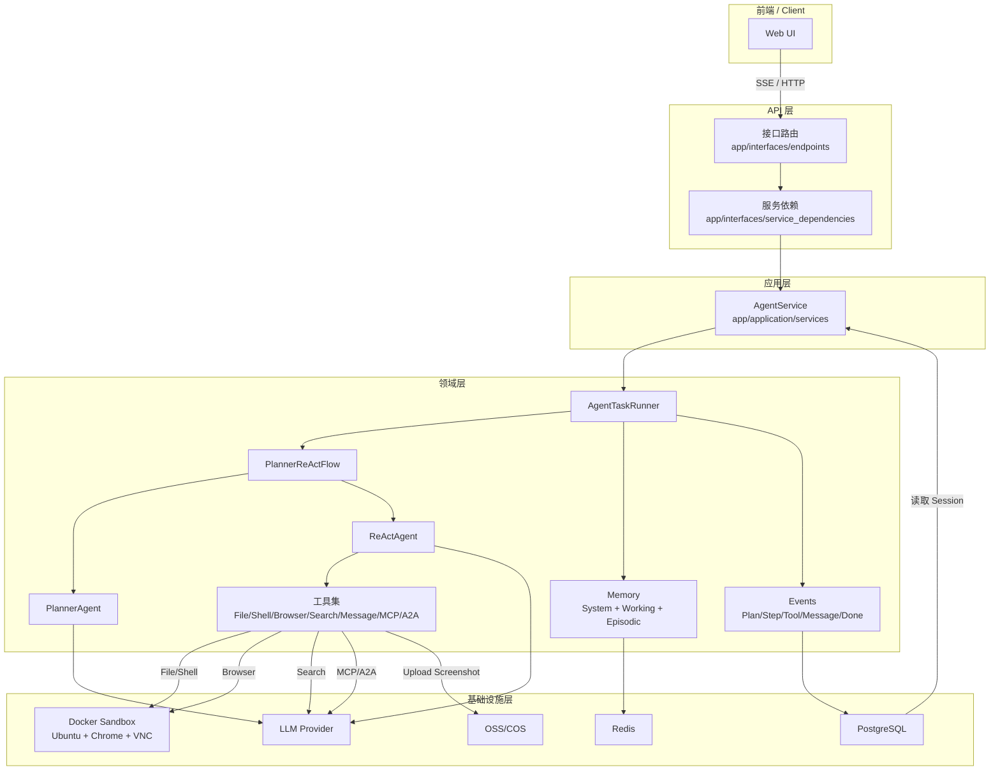

---

## 2. 请求处理时序图

以下以「LangGraph 示例项目调研与本地部署」任务为例，展示覆盖全部事件类型与全部工具函数的请求处理时序。

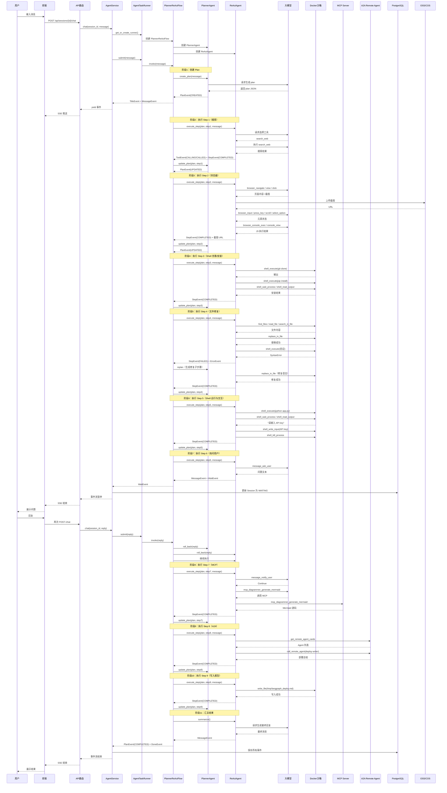

---

## 3. PlannerReActFlow 状态机

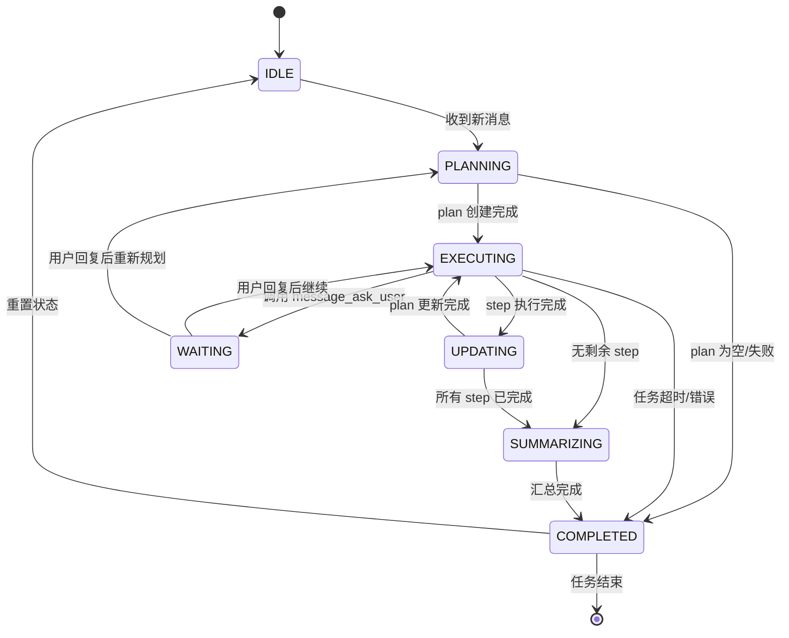

---

## 4. 单 Step 执行详细流程

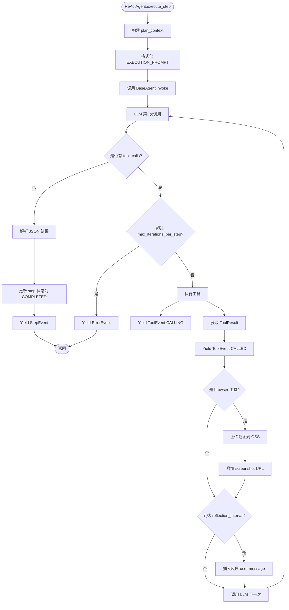

---

## 5. 工具调用流程

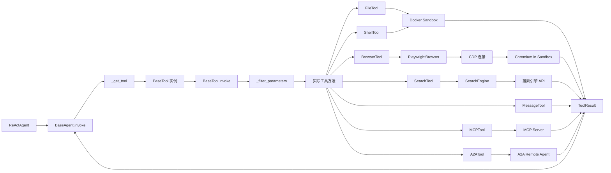

---

## 6. 记忆系统流程

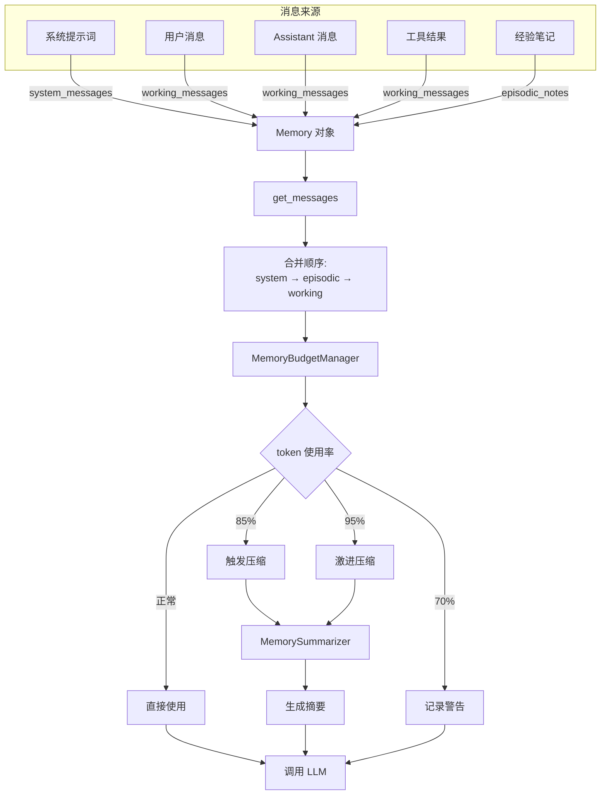

---

## 7. 防跑偏机制流程

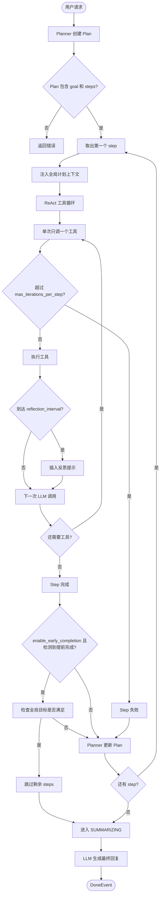

---

## 8. 事件流与持久化

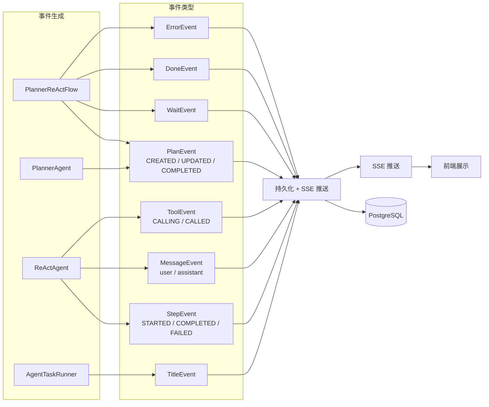

### 事件类型说明

| 事件类型 | 触发方 | 典型状态/角色 | 说明 |
|---|---|---|---|
| `plan` | PlannerAgent / PlannerReActFlow | `created` / `updated` / `completed` | 计划的创建、更新与完成 |
| `title` | AgentTaskRunner | - | 会话标题 |
| `step` | ReActAgent / PlannerReActFlow | `started` / `completed` / `failed` | 步骤开始、完成、失败 |
| `message` | AgentService / ReActAgent / summarize | `user` / `assistant` | 用户消息与助手消息 |
| `tool` | ReActAgent / BaseAgent | `calling` / `called` | 工具调用前后 |
| `wait` | PlannerReActFlow | - | 等待用户回复 |
| `error` | PlannerReActFlow / AgentService | - | 步骤失败或服务异常 |
| `done` | PlannerReActFlow | - | 任务正常结束 |

---

## 9. Docker 沙箱内部结构

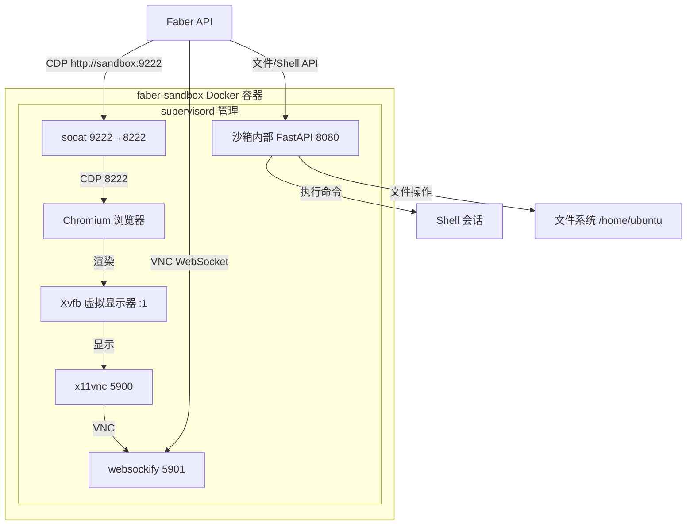

---

## 10. 完整执行流程一览（全事件/全工具覆盖示例）

以「LangGraph 示例项目调研与本地部署」任务为例，展示如何串联全部事件与全部工具函数。

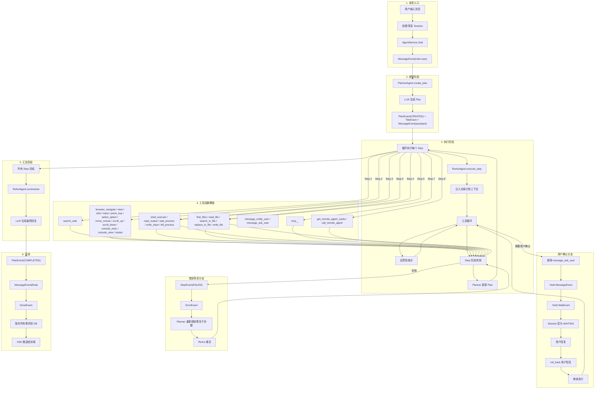

---

## 11. 用户确认（ask_user）流程

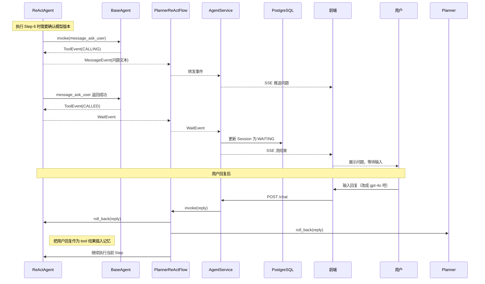

---

## 12. 工具函数全景图

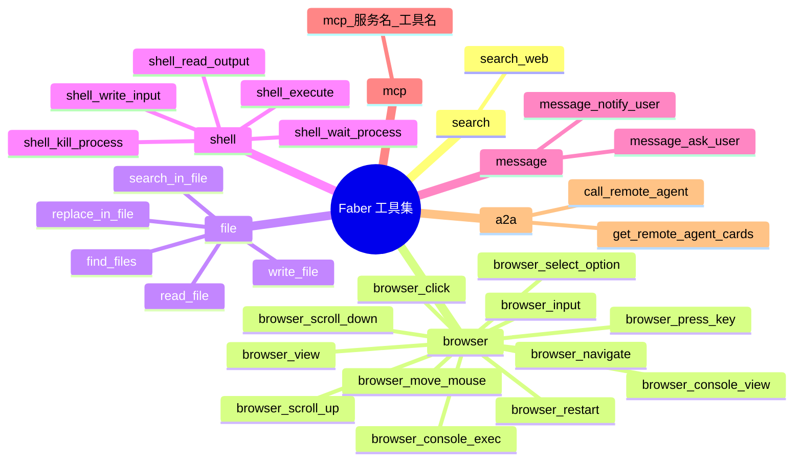

---

*文档更新时间：2026-06-17*
