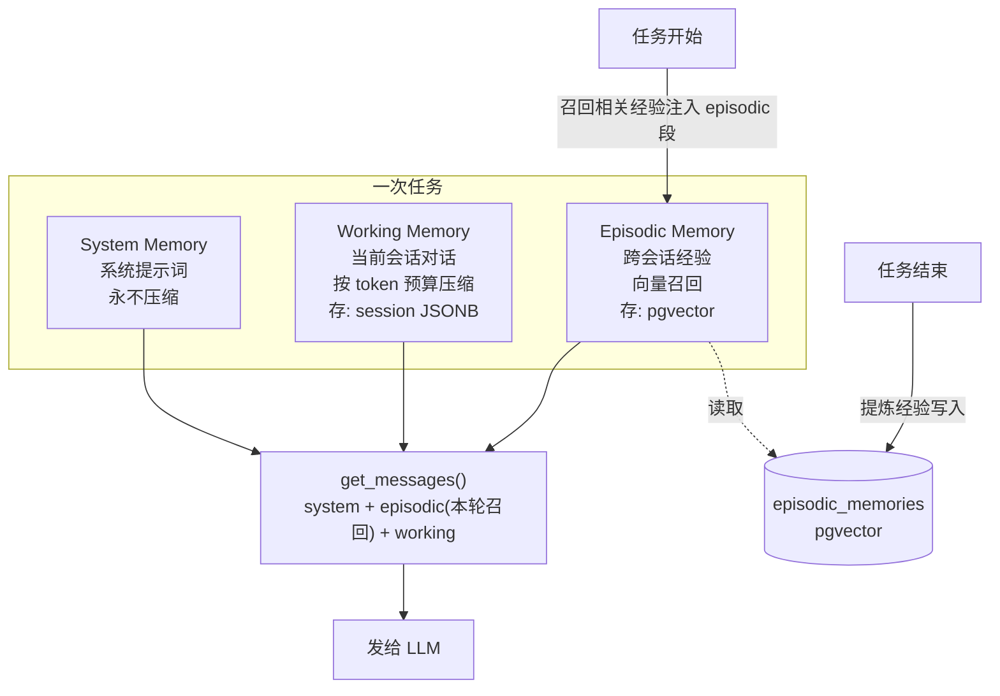
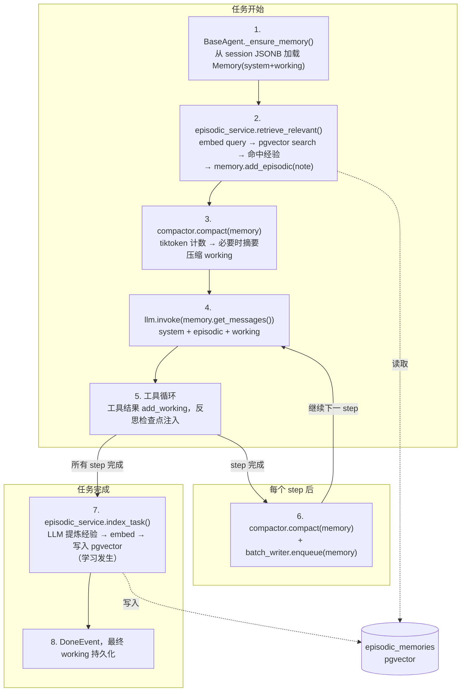

# 记忆系统重设计

> 状态：设计稿（待确认后实施）  
> 适用：个人项目，允许从零重写，不考虑向后兼容的历史负债（保留旧格式自动迁移即可）。

本文档是记忆系统从零重写的完整设计。目标是把当前「半死不活」的记忆系统替换成一套**真正能用的三层记忆**：干净的工作记忆 + 真正跨会话学习的情景记忆。

---

## 1. 背景：为什么重写

当前记忆系统（`app/domain/services/memory/` + `app/domain/models/memory.py`）有 14 处结构性问题，其中 3 处是致命的：

### 致命问题

1. **情景记忆整套是死代码。** `VectorMemory` 用的是手搓词频-余弦（不是真 embedding），`MemoryRetriever.index_*` 方法**全代码库无人调用**，vector store 永远为空，`retrieve_for_*` 永远返回 `[]`。所谓「跨会话学习」从未发生。
2. **Token 估算是错的。** `TokenCounter` 用中文×1.5/英文×1.3 的启发式，刻意高估；而 budget 又拿 `LLM.max_tokens`（实为「最大输出 token」，DeepSeek 默认 8192）当上下文上限。两者叠加导致 compaction **过早触发**，白白浪费上下文。
3. **写入失败被静默吞掉。** `DBMemoryBatchWriter` 批量写记忆失败时只打一条日志就吞掉异常「避免打断 Agent」，意味着 DB 抖动时记忆可能丢失且无人知晓。另外 `db_session_repository.py:284` 引用了未定义的 `logger`，读到旧格式记忆会直接 `NameError`。

### 结构性问题

| # | 问题 | 位置 |
|---|---|---|
| 4 | 内容字符串嗅探路由：靠 `content.startswith("[经验]")` 判定 episodic vs system | `memory.py:50` |
| 5 | `_budget_manager` 作为 Pydantic 私有字段挂在数据模型上，数据与行为耦合 | `memory.py:24` |
| 6 | `get_messages()` 返回底层 dict 的引用，compaction 通过拼接列表间接改写原数据 | `memory.py:26-33` |
| 7 | `messages` 属性与 `get_messages()` 完全重复 | `memory.py` |
| 8 | `BaseAgent.__init__` 的 retriever 回退竟 new 了一个 `MemoryBudgetManager`（类型错误） | `base.py:59` |
| 9 | Planner 从不走 LLM 摘要压缩（只 inline 走粗暴的 `"(removed)"`），仅 ReAct 走摘要 | `planner_react.py:230` |
| 10 | `VectorMemory._load_cache` 每次 add/search 都全量重读 Redis Hash + JSON 解析，O(n) | `vector_memory.py` |
| 11 | episodic_notes 永不压缩（budget 跳过 `role=="system"`），若真生效会无限增长 | `memory_budget.py:135` |
| 12 | `empty` 属性忽略 episodic | `memory.py:141` |
| 13 | 没有结构化的「Agent 学到了什么」实体，只有 message dict | 全局 |
| 14 | 没有真正的 embedding 接口与向量库，只有伪装成向量库的 TF-cosine | 全局 |

**结论：** 修补不如重写。情景记忆这条主线必须从无到有做对，工作记忆顺手做干净。

---

## 2. 设计目标

1. **真正可用的跨会话学习**：任务完成后提炼经验写入长期记忆，下次类似任务自动召回。
2. **干净的工作记忆**：结构清晰、压缩聪明、持久化可靠、token 计数准确。
3. **纯粹的数据模型**：`Memory` 只承载数据，压缩/检索是外部服务，不再互相纠缠。
4. **显式分段，无魔法字符串**：system / working / episodic 由调用方显式写入，不靠字符串嗅探。
5. **可观测、不静默失败**：写入失败要可见、可重试。
6. **复用现有基建**：Alembic 迁移、UoW+Repository 模式、asyncpg、已有的 Postgres 扩展加载机制。

---

## 3. 三层记忆架构



| 层 | 范围 | 存储 | 生命周期 | 压缩 |
|---|---|---|---|---|
| **System** | 系统提示词 + 角色提示词 | session JSONB（随 working 一起） | 单会话 | 永不 |
| **Working** | 当前任务对话（user/assistant/tool） | session JSONB `memories[agent_name]` | 单会话 | token 预算驱动，LLM 摘要 |
| **Episodic** | 跨会话的「经验记录」 | **新表 `episodic_memories`（pgvector）** | 永久 | 按重要性 + 使用频率淘汰 |

---

## 4. 组件设计

### 4.1 Token 计数：tiktoken（替换启发式）

**新文件**：重写 `app/domain/services/memory/token_counter.py`

```python
import tiktoken

class TokenCounter:
    _encoders: dict[str, tiktoken.Encoding] = {}  # 模型→编码，模块级缓存

    @classmethod
    def _encoding_for(cls, model_name: str) -> tiktoken.Encoding:
        # DeepSeek deepseek-chat/reasoner 用 o200k_base；其它按 tiktoken 规则，回退 cl100k_base
        ...

    def count_text(self, text: str, model_name: str = None) -> int: ...
    def count_messages(self, messages: list[dict], model_name: str = None) -> int:
        # 精确按 message 结构累加，含 tool_calls / reasoning_content
        ...
```

**要点**：
- 依赖：`pyproject.toml` 加 `tiktoken`。
- 编码映射：`deepseek-*` → `o200k_base`；其余走 `tiktoken.encoding_for_model`，失败回退 `cl100k_base`。
- 编码器模块级缓存，避免重复加载。

**新增配置**：`AgentConfig` 加 `context_window: int = 65536`（DeepSeek 上下文窗口）。
**可用上下文** = `context_window − max_tokens(输出) − reserve(默认 1024)`，这才是 budget 真正的上限。

### 4.2 Memory 模型 v2（纯数据）

**重写**：`app/domain/models/memory.py`

```python
class Memory(BaseModel):
    system: list[dict] = []       # 系统提示词
    working: list[dict] = []      # 当前会话对话
    episodic: list[dict] = []     # 本轮从 pgvector 召回的经验（瞬态，不持久化）

    # 显式写入，无魔法字符串路由
    def add_system(self, message): ...
    def add_working(self, message): ...
    def add_episodic(self, note: str, metadata: dict = None): ...
    def add_messages(self, messages): ...  # 按 role 分流到 system/working

    # 返回全新列表（system + episodic + working），不再返回底层引用
    def get_messages(self) -> list[dict]: ...

    # 压缩委托给外部 MemoryCompactor，模型只提供受控改写入口
    def replace_working(self, new_working: list[dict]): ...
    def roll_back_last(self): ...

    @property
    def empty(self) -> bool: ...   # 三段都判空
```

**关键修复**：
- **去掉 `_budget_manager` 私有字段**：压缩是 `MemoryCompactor` 服务，操作 `Memory`，不再挂在模型上。
- **去掉魔法字符串路由**：`add_messages` 按 `role` 分流（`system`→system，其余→working），episodic 只由专门的召回路径写入。
- **`get_messages()` 返回全新拼接列表**，压缩只通过 `replace_working()` 改模型自己的列表，杜绝共享引用陷阱。
- **episodic 不进 JSONB**：每轮从 pgvector 重新召回注入，`to_dict()` 只序列化 system+working。
- **保留旧格式迁移**：`from_legacy_dict()` 兼容 `{"messages":[...]}` 和 `{system_messages, working_messages, episodic_notes}` 两种旧格式。

### 4.3 Embedder（新增接口）

DeepSeek 无 embedding 接口，故**独立于 chat LLM**，做成 OpenAI 兼容的 provider-agnostic 实现（OpenAI / SiliconFlow / 本地 BGE 等都行）。

**新文件**：`app/domain/external/embedder.py`

```python
class Embedder(Protocol):
    @property
    def dimension(self) -> int: ...
    async def embed(self, texts: list[str]) -> list[list[float]]: ...
    async def embed_query(self, text: str) -> list[float]: ...
```

**新文件**：`app/infrastructure/external/embedder/openai_embedder.py`

```python
class OpenAIEmbedder(Embedder):
    def __init__(self, config: EmbeddingConfig):
        self._client = AsyncOpenAI(base_url=config.base_url, api_key=config.api_key)
        self._model = config.model_name
        self._dimension = config.dimension
        self._batch_size = config.batch_size

    async def embed(self, texts):  # 按 batch_size 分批调 client.embeddings.create
        ...
```

**新配置**（`app/domain/models/app_config.py`）：

```python
class EmbeddingConfig(BaseModel):
    enabled: bool = False
    base_url: HttpUrl = "https://dashscope.aliyuncs.com/compatible-mode/v1"
    api_key: str = ""                 # DASHSCOPE_API_KEY（复用 faber-rag 的 key）
    model_name: str = "text-embedding-v3"   # DashScope Qwen，1024 维
    dimension: int = 1024
    batch_size: int = 32
```

> **待决（需要你提供）**：选哪个 embedding provider/model。默认推荐 `BAAI/bge-m3`（1024 维，SiliconFlow 免费额度，中英文兼顾）；备选 OpenAI `text-embedding-3-small`（1536 维）。dimension 必须与 pgvector 列维度一致。

### 4.4 Episodic 存储表：pgvector

**新模型**：`app/infrastructure/models/episodic_memory.py`

```python
from pgvector.sqlalchemy import Vector

class EpisodicMemoryModel(Base):
    __tablename__ = "episodic_memories"
    id              = Column(String(255), primary_key=True, default=uuid4)
    agent_name      = Column(String(64), index=True)   # planner | react | global
    source_session  = Column(String(255), nullable=True)
    summary         = Column(String(512))              # 一句话标题
    content         = Column(Text)                      # 完整经验文本
    metadata_       = Column(JSONB, default=dict)       # goal / tools / success / tags
    importance      = Column(Float, default=0.5)        # 0~1，影响召回与淘汰
    embedding       = mapped_column(Vector(1024))       # 维度 = EmbeddingConfig.dimension
    use_count       = Column(Integer, default=0)
    last_used_at    = Column(DateTime, nullable=True)
    created_at      = Column(DateTime, server_default=func.now())
```

**迁移**（新 Alembic revision，`alembic revision --autogenerate` 后手改）：

```python
def upgrade():
    op.execute("CREATE EXTENSION IF NOT EXISTS vector;")
    op.create_table("episodic_memories", ...)
    op.create_index(
        "ix_episodic_memories_embedding",
        "episodic_memories", ["embedding"],
        postgresql_using="hnsw",
        postgresql_with={"m": 16, "ef_construction": 64},
        postgresql_ops={"embedding": "vector_cosine_ops"},
    )
```

- `postgres.py:init()` 在已有 `CREATE EXTENSION "uuid-ossp"` 旁加 `CREATE EXTENSION IF NOT EXISTS vector;`。
- `app/infrastructure/models/__init__.py` 导出新模型，Alembic autogenerate 才能识别。

**新依赖**：`pyproject.toml` 加 `pgvector`。

**Postgres 容器化（已确定方案）**：当前 DB 是本机裸装（`localhost:5432`，无 compose 管理），无法直接换镜像。改为引入 `pgvector/pgvector:pg16` 容器并映射到 host `5432`，**连接串 `localhost:5432` 保持不变**，API 代码零改动。新增 `docker-compose.yml`（放 `api/` 根目录，或并入现有 sandbox 网络）：

```yaml
services:
  postgres:
    image: pgvector/pgvector:pg16
    container_name: faber-postgres
    environment:
      POSTGRES_USER: postgres
      POSTGRES_PASSWORD: postgres
      POSTGRES_DB: faber
    ports:
      - "5432:5432"
    volumes:
      - faber_pgdata:/var/lib/postgresql/data
volumes:
  faber_pgdata:
```

> 启动：`docker compose up -d postgres`。个人项目数据可重建，无需从旧裸库迁移；若需保留，先 `pg_dump` 再导入容器。`pgvector/pgvector:pg16` 镜像自带 vector 扩展，`CREATE EXTENSION vector` 可直接成功。

**Repository**：

```python
# app/domain/repositories/episodic_memory_repository.py
class EpisodicMemoryRepository(Protocol):
    async def add(self, record) -> str: ...
    async def search(self, query_vec, agent_name, top_k=3, max_distance=0.6) -> list: ...  # cosine
    async def increment_use(self, id) -> None: ...
    async def delete(self, id) -> None: ...
    async def prune(self, agent_name, keep_top_n) -> int: ...   # 按重要性淘汰
```

DB 实现用 pgvector 的 `<=>`（余弦距离）算子：`EpisodicMemoryModel.embedding.cosine_distance(query_vec)`。

**注册 UoW**：`IUnitOfWork` 加 `episodic_memory: EpisodicMemoryRepository`；`DBUnitOfWork.__aenter__` 实例化 `DBEpisodicMemoryRepository(db_session)`。

### 4.5 Episodic 服务：学习闭环（核心新功能）

**新文件**：`app/domain/services/memory/episodic_memory_service.py`

```python
class EpisodicMemoryService:
    def __init__(self, embedder, repository, llm, top_k=3, max_distance=0.6):
        ...

    # —— 召回：任务开始时调用 ——
    async def retrieve_relevant(self, query: str, agent_name: str) -> list[EpisodicNote]:
        if not self._embedder: return []
        qvec = await self._embedder.embed_query(query)
        hits = await self._repo.search(qvec, agent_name, self._top_k, self._max_distance)
        await asyncio.gather(*[self._repo.increment_use(h.id) for h in hits])
        return [self._to_note(h) for h in hits]

    # —— 写入：任务完成时调用（当前缺失的关键路径）——
    async def index_task(self, session_id, agent_name, plan, step_results):
        if not self._embedder: return
        # 1. LLM 把完成的任务提炼成 1~N 条可复用经验
        lessons = await self._extract_lessons(plan, step_results)
        # 2. 每条经验 embed
        for lesson in lessons:
            vec = await self._embedder.embed_query(lesson.content)
            await self._repo.add(EpisodicMemory(
                agent_name=agent_name, source_session=session_id,
                summary=lesson.summary, content=lesson.content,
                metadata=lesson.metadata, importance=lesson.importance,
                embedding=vec,
            ))
```

**`_extract_lessons` 的 prompt 思路**（参考 `docs/23-如何编写Prompt.md` 的写法）：

```text
任务已结束，请从以下任务记录中提炼「可复用的经验」：
- 任务目标：{goal}
- 采取的步骤与结果：{steps}
- 用到的工具：{tools}

提炼要求：
- 每条经验是一个独立、可迁移的结论（不是流水账）
- 包含：适用场景 / 有效做法 / 陷阱
- 只产出真正可复用的，宁缺毋滥

返回 JSON：{ lessons: [{ summary, content, importance(0~1), tags:[] }] }
```

**两条接入点**（Phase 3）：
- **召回**：`BaseAgent._invoke_llm` 里替换掉死的 episodic 检索，改为 `notes = await episodic_service.retrieve_relevant(query, self.name)`，逐条 `memory.add_episodic(note)`。
- **写入**：`PlannerReActFlow` 进入 `COMPLETED` 时（或 `AgentTaskRunner` 收尾时）调用 `episodic_service.index_task(session_id, agent_name, plan, step_results)`。**这是当前完全缺失的一环，补上它情景记忆才真正工作。**

### 4.6 工作记忆压缩（修正）

**改造**：`app/domain/services/memory/memory_budget.py` → 可改名 `MemoryCompactor`

```python
class MemoryCompactor:
    def __init__(self, token_counter, summarizer, usable_context, 
                 soft=0.70, hard=0.85, emergency=0.95):
        ...

    async def compact(self, memory: Memory, model_name: str) -> bool:
        tokens = self._token_counter.count_messages(memory.get_messages(), model_name)
        ratio = tokens / self._usable_context
        if ratio < self._hard: 
            return False
        aggressive = ratio >= self._emergency
        await self._compact_by_value(memory, aggressive, model_name)
        return True
```

**修复点**：
- 预算基于 `usable_context`（context_window − 输出 − reserve），不再用 `max_tokens`。
- token 用 tiktoken 精确计数。
- 压缩时**调用 summarizer 生成摘要**替换内容，不再粗暴写 `"(removed)"`（summarizer 注入 compactor）。
- 通过 `memory.replace_working(new_list)` 改写，不碰 `get_messages()` 返回值。
- Planner 与 ReAct **统一走同一压缩路径**（去掉「只有 ReAct 走摘要」的不一致）。
- system 段与最近 N 条消息受保护，不压缩。

### 4.7 持久化可靠性（修正）

- **`DBMemoryBatchWriter`**：失败时**重试 2 次**（指数退避），最终失败按 ERROR 级别打日志（含 session_id、agent_name），并保留在队列下次 flush 再试，而非静默丢弃。
- **`db_session_repository.py`**：补 `import logging` + `logger = logging.getLogger(__name__)`，修掉 `get_memory` 读旧格式时的 `NameError`。`save_memory`/`get_memory` 改用新 `Memory` 模型的序列化方法。

---

## 5. 数据流：一次任务的完整记忆生命周期



---

## 6. 分阶段迁移计划

每个阶段独立可交付，系统全程可运行。

### Phase 1 — 基础设施（纯新增，不破坏现有）  ← 任务 #5
- [ ] 新增 `docker-compose.yml`（pgvector/pgvector:pg16，映射 host 5432）
- [ ] `pyproject.toml` 加 `tiktoken`、`pgvector`
- [ ] 重写 `TokenCounter`（tiktoken）
- [ ] `AgentConfig` 加 `context_window`
- [ ] `Embedder` Protocol + `EmbeddingConfig`（DashScope/Qwen 默认）+ `OpenAIEmbedder`
- [ ] `EpisodicMemoryModel`（Vector(1024)）+ `models/__init__.py` 导出
- [ ] Alembic 迁移（CREATE EXTENSION vector + 表 + HNSW 索引）
- [ ] `postgres.py:init()` 加载 vector 扩展
- [ ] `EpisodicMemoryRepository` 接口 + DB 实现 + UoW 注册
- [ ] `config.yaml` 加 `embedding_config` 占位（base_url/model/dimension，api_key 留空待填）
- **验证**：`docker compose up -d postgres` → `alembic upgrade head` 成功；`SELECT * FROM episodic_memories` 存在；填 key 后手动调 embedder 能出 1024 维向量。

### Phase 2 — 新 Memory 模型 + 情景服务  ← 任务 #6（依赖 #5）
- [ ] 重写 `Memory` 模型（显式分段、深拷贝、去私有字段、保留旧格式迁移）
- [ ] `EpisodicMemoryService`（retrieve_relevant + index_task + _extract_lessons prompt）
- [ ] `MemoryCompactor`（预算修正 + summarizer 注入）
- [ ] `db_session_repository` 适配新模型 + 修 logger bug
- **验证**：单测 Memory 序列化/反序列化（含旧格式）；手工调 service.index_task 能写库、retrieve_relevant 能召回。

### Phase 3 — 接入 Agent 与 Flow  ← 任务 #7（依赖 #6）
- [ ] `BaseAgent`：episodic 检索换成 `EpisodicMemoryService`；压缩走新 compactor；修 retriever 回退类型 bug
- [ ] `PlannerReActFlow`：COMPLETED 时调 `index_task`
- [ ] `DBMemoryBatchWriter`：加重试 + ERROR 日志
- **验证**：跑一个真实任务，确认任务结束后 pgvector 里有记录；起第二个相似任务，确认 episodic 被召回注入。

### Phase 4 — 清理与文档  ← 任务 #8（依赖 #7）
- [ ] 删除 `VectorMemory`、`MemoryRetriever`（Redis 路径）、`vector_memory:*` Redis key
- [ ] 删除旧启发式 token 估算（若被 tiktoken 完全替代）
- [ ] 写 `docs/25-记忆系统架构.md`（新架构文档）
- **验证**：grep 确认无残留引用；全量回归测试。

---

## 7. 文件改动清单

### 新增
| 文件 | 内容 |
|---|---|
| `app/domain/external/embedder.py` | Embedder Protocol |
| `app/infrastructure/external/embedder/openai_embedder.py` | OpenAI 兼容实现 |
| `app/infrastructure/models/episodic_memory.py` | pgvector ORM 模型 |
| `app/domain/repositories/episodic_memory_repository.py` | Repository Protocol |
| `app/infrastructure/repositories/db_episodic_memory_repository.py` | DB 实现 |
| `app/domain/services/memory/episodic_memory_service.py` | 召回 + 索引服务 |
| `alembic/versions/xxxx_create_episodic_memories.py` | 迁移 |

### 重写
| 文件 | 变更 |
|---|---|
| `app/domain/models/memory.py` | Memory v2（显式分段、去私有字段、深拷贝） |
| `app/domain/services/memory/token_counter.py` | tiktoken 实现 |
| `app/domain/services/memory/memory_budget.py` | → MemoryCompactor（预算修正、summarizer 注入） |

### 修改
| 文件 | 变更 |
|---|---|
| `pyproject.toml` | + tiktoken, pgvector |
| `app/domain/models/app_config.py` | + EmbeddingConfig, AgentConfig.context_window |
| `app/interfaces/schemas/app_config.py` | 对应 schema |
| `config.yaml` | embedding 配置占位 |
| `app/infrastructure/storage/postgres.py` | init() 加载 vector 扩展 |
| `app/infrastructure/models/__init__.py` | 导出 EpisodicMemoryModel |
| `app/domain/repositories/uow.py` | + episodic_memory |
| `app/infrastructure/repositories/db_uow.py` | 实例化 episodic repo |
| `app/infrastructure/repositories/db_session_repository.py` | 适配新 Memory + 修 logger |
| `app/infrastructure/memory/db_memory_batch_writer.py` | 重试 + ERROR 日志 |
| `app/domain/services/agents/base.py` | episodic 检索换服务、压缩换 compactor、修回退 bug |
| `app/domain/services/flows/planner_react.py` | COMPLETED 调 index_task |
| `app/interfaces/service_dependencies.py` | 装配 Embedder/EpisodicMemoryService/Compactor |

### 删除（Phase 4）
| 文件 | 原因 |
|---|---|
| `app/domain/services/memory/vector_memory.py` | 死代码，被 pgvector 取代 |
| `app/domain/services/memory/memory_retriever.py` | 被 EpisodicMemoryService 取代 |

---

## 8. 已确定的事项（原待拍板项，已决策）

经核查项目实际情况后定稿：

1. **Embedding provider / model** → **DashScope Qwen `text-embedding-v3`，1024 维**，`base_url: https://dashscope.aliyuncs.com/compatible-mode/v1`。
   - 依据：复用同仓库 `faber-rag` 项目已验证的方案，用户多半已有 `DASHSCOPE_API_KEY`；OpenAI 兼容，`OpenAIEmbedder` 无需改动；国内稳定。
   - 决定 `EmbeddingConfig` 默认值与 pgvector 列维度（1024）。
   - 备选：SiliconFlow `BAAI/bge-m3`（检索质量略高、有免费额度），如需切换只改配置不改代码。
2. **Postgres pgvector 扩展** → **引入 `pgvector/pgvector:pg16` 容器**，映射 host `5432`，连接串不变。
   - 依据：当前 DB 为本机裸装、无 compose 管理，无法换镜像；容器化最干净、可复现，与 sandbox 的 Docker 用法一致。
   - 新增 `docker-compose.yml`（见 §4.4）；`postgres.py:init()` 加 `CREATE EXTENSION IF NOT EXISTS vector;`。
   - 唯一前置动作：用户执行 `docker compose up -d postgres` 启动容器（替代本机裸 PG）。

---

## 9. 验证方式

- **单元**：Memory v2 序列化/反序列化（含两种旧格式）；TokenCounter 与模型实际 token 数对比；Compactor 在阈值上下行为正确。
- **集成**：
  - `alembic upgrade head` → 表与索引存在。
  - 跑一个真实任务（如「搜索 X 并写报告」），任务结束后 `SELECT count(*) FROM episodic_memories` > 0。
  - 起第二个**相似**任务，在日志中确认 `retrieve_relevant` 命中并注入 episodic 段。
  - 构造超长对话，确认 compactor 在 ~85% 触发、summarizer 产出摘要、`get_messages()` token 数下降。
  - 模拟 DB 写失败，确认 batch writer 重试并 ERROR 日志可见。
- **回归**：现有事件流示例（`docs/21`）跑通，无回归。

---

*设计稿时间：2026-06-22*
