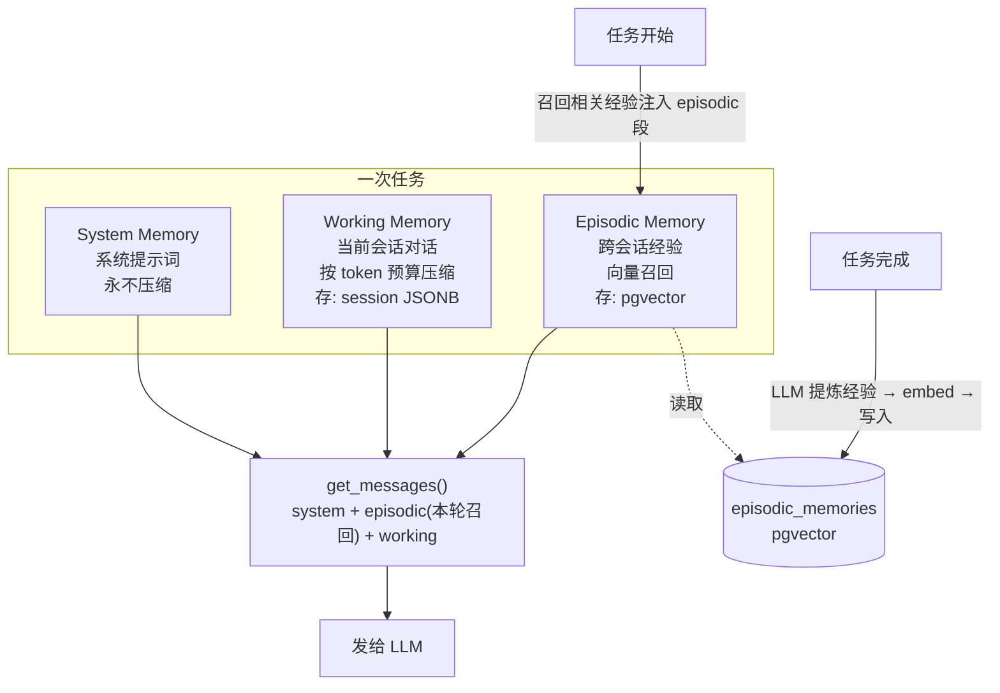
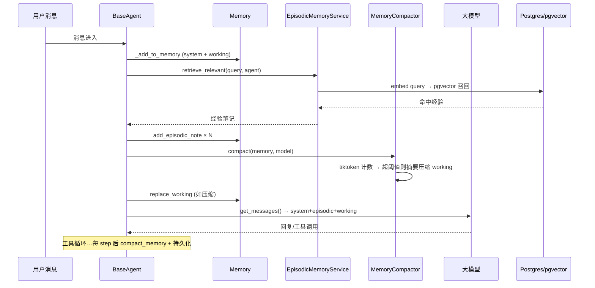

# 记忆系统架构

> 本文描述 Faber API 记忆系统重写（v2）后的架构。设计与背景见 `docs/24-记忆系统重设计.md`。

记忆系统让 Agent 在单次任务内拥有「上下文」，并能跨会话积累「经验」。它由三层组成，分别解决不同问题。

---

## 1. 三层架构



| 层 | 内容 | 存储 | 生命周期 | 压缩/淘汰 |
|---|---|---|---|---|
| **System** | 系统提示词 + 角色提示词 | `sessions.memories[agent].system_messages`（JSONB） | 单会话 | 永不 |
| **Working** | 当前任务对话（user/assistant/tool） | `sessions.memories[agent].working_messages`（JSONB） | 单会话 | token 预算驱动，LLM 摘要 |
| **Episodic** | 跨会话可复用经验 | `episodic_memories` 表（pgvector） | 永久 | 按重要性 + 使用频率 |

> Episodic 段在内存中是「瞬态」的：每轮从 pgvector 召回注入，**不持久化进 JSONB**（`to_dict()` 只写 system + working）。

---

## 2. 核心组件

### 2.1 `Memory`（领域模型，纯数据）
`app/domain/models/memory.py`

三层分段 `system_messages` / `working_messages` / `episodic_notes`，只承载数据：

- `add_message(msg)`：按 `role` 分流（system→system，其余→working），**无魔法字符串嗅探**。
- `add_episodic_note(note)`：仅由召回路径显式写入。
- `get_messages()`：返回**全新列表**（system → episodic → working），不返回底层引用。
- `replace_working(new)`：受控改写入口，供压缩器回写。
- `to_dict()` / `from_dict()`：持久化序列化，`from_dict` 兼容三种历史格式（`{messages}` / `{system_messages,working_messages,episodic_notes}` / 新格式）。

**相比旧版的关键变化：** 去掉了挂在模型上的 `_budget_manager` 私有字段与 `compact()` 方法——压缩是外部服务，模型保持纯净。

### 2.2 `TokenCounter`（tiktoken 精确计数）
`app/domain/services/memory/token_counter.py`

基于 tiktoken 精确计数，替代旧的中文×1.5/英文×1.3 启发式。DeepSeek 系列用 `o200k_base`，Qwen 用 `cl100k_base`，其余走 tiktoken 官方映射，全失败回退 `cl100k_base`。编码器模块级缓存。`count_messages(messages, model_name)` 向后兼容（model_name 可选）。

### 2.3 `MemoryCompactor`（token 预算压缩）
`app/domain/services/memory/memory_budget.py`

- 预算 = `usable_context` = `context_window − max_tokens − 1024`（在 `service_dependencies` 计算），**不再误用 `max_tokens` 当上限**。
- 阈值：70% 仅记录 / 85% 压缩 / 95% 紧急压缩。
- 压缩只作用于 `working` 段；按「消息价值/token」升序排序，优先压缩低价值（浏览器结果、旧 tool 结果）消息，**最近 2 条与 system 受保护**。
- 压缩时调用注入的 `MemorySummarizer` 生成 LLM 摘要，替代粗暴的 `"(removed)"`。
- **构建新 working 列表后 `replace_working` 回写**，不再就地修改消息 dict（消除共享引用陷阱）。
- Planner / ReAct 共用同一压缩路径（`BaseAgent._invoke_llm` 每轮 + `compact_memory` 每 step）。

### 2.4 `EpisodicMemoryService`（学习闭环）
`app/domain/services/memory/episodic_memory_service.py`

- `retrieve_relevant(query, agent_name)`：任务开始时，embed 查询 → pgvector 余弦召回 → `increment_use` → 返回经验笔记列表。注入到 `Memory.episodic_notes`。
- `index_task(session_id, agent_name, plan, message)`：任务完成时，用 LLM 从 plan + 步骤结果提炼可复用经验（JSON），批量 embed → 写入 pgvector。**这是旧系统完全缺失的写入路径**。
- 未配置 Embedder 时整体降级为空操作，不影响普通会话。

### 2.5 `Embedder` / `OpenAIEmbedder`
`app/domain/external/embedder.py` + `app/infrastructure/external/embedder/openai_embedder.py`

独立于 LLM 的 embedding 接口（DeepSeek 无 embedding 能力）。`OpenAIEmbedder` 兼容 OpenAI / DashScope(Qwen) / SiliconFlow / 本地服务，默认 DashScope `text-embedding-v3`（1024 维）。按 `batch_size` 分批调用，响应按 `index` 排序。

### 2.6 情景记忆存储（pgvector）
- 表 `episodic_memories`：`agent_name` / `source_session` / `summary` / `content` / `metadata(JSONB)` / `importance` / `embedding(Vector(1024))` / `use_count` / `last_used_at` / `created_at`。HNSW + `vector_cosine_ops` 索引。
- 仓库 `DBEpisodicMemoryRepository`：`add` / `search`(余弦距离 `<=>` 召回) / `increment_use` / `get_by_id` / `delete` / `count_by_agent`。
- 注册在 UoW：`uow.episodic_memory`。
- Postgres 需 pgvector 扩展（`pgvector/pgvector:pg16` 镜像），`postgres.init()` 会 `CREATE EXTENSION IF NOT EXISTS vector`（缺失时仅告警降级，不阻断启动）。

---

## 3. 一次任务的记忆生命周期



任务完成（Flow 进入 COMPLETED）时，Flow 调用 `EpisodicMemoryService.index_task` 提炼经验写入 pgvector——**学习在此刻发生**。

---

## 4. 持久化与可靠性

- **Working/System**：`sessions.memories[agent]` JSONB，`DBSessionRepository.save_memory/get_memory` 用 `Memory.to_dict/from_dict`。`MemoryBatchWriter` 异步批量写（去重 + 后台 flush）。
- **Episodic**：`episodic_memories` 表，事务内经 `uow.episodic_memory` 读写。
- **不再静默吞错**：`DBMemoryBatchWriter` 写失败重试 2 次（指数退避），最终失败按 **ERROR 级别**打日志（含受影响 session/agent），而非旧版的静默丢弃。
- **旧格式自动迁移**：`Memory.from_dict` 兼容历史 `{messages}` 与三字段格式，读出时自动升级。

---

## 5. 配置

`config.yaml`：

```yaml
agent_config:
  context_window: 65536        # 模型上下文窗口，用于计算可用预算
embedding_config:
  enabled: false               # 启用情景记忆需置 true + 填 api_key
  base_url: https://dashscope.aliyuncs.com/compatible-mode/v1
  api_key: ""                  # DASHSCOPE_API_KEY
  model_name: text-embedding-v3
  dimension: 1024              # 必须与 pgvector 列维度一致（改维度需新建迁移+重新 embed）
  batch_size: 32
```

`dimension` 必须与 `EpisodicMemoryModel.EMBEDDING_DIMENSION`(=1024) 一致；修改维度需新建 Alembic 迁移并重新生成已有向量。

---

## 6. 启用情景记忆的 3 步

```bash
# 1. 启动带 pgvector 的 Postgres 容器（替换本机裸装 PG）
docker compose up -d postgres

# 2. 应用迁移（建 episodic_memories 表 + HNSW 索引）
uv run alembic upgrade head

# 3. 在 config.yaml 填 key 并启用
#    embedding_config.enabled: true
#    embedding_config.api_key: <你的 DASHSCOPE_API_KEY>
```

未启用时，系统仍完整可用（Working/System 正常工作），仅跨会话学习不生效。

---

## 7. 文件索引

| 关注点 | 路径 |
|---|---|
| Memory 模型 | `app/domain/models/memory.py` |
| Episodic 领域模型 | `app/domain/models/episodic_memory.py` |
| TokenCounter (tiktoken) | `app/domain/services/memory/token_counter.py` |
| MemoryCompactor | `app/domain/services/memory/memory_budget.py` |
| MemorySummarizer | `app/domain/services/memory/memory_summarizer.py` |
| EpisodicMemoryService | `app/domain/services/memory/episodic_memory_service.py` |
| Embedder 接口 | `app/domain/external/embedder.py` |
| OpenAIEmbedder | `app/infrastructure/external/embedder/openai_embedder.py` |
| Episodic ORM (pgvector) | `app/infrastructure/models/episodic_memory.py` |
| Episodic 仓库接口 | `app/domain/repositories/episodic_memory_repository.py` |
| Episodic 仓库实现 | `app/infrastructure/repositories/db_episodic_memory_repository.py` |
| 迁移 | `alembic/versions/e4c1f7a92b3d_create_episodic_memories.py` |
| UoW（注册 episodic_memory） | `app/domain/repositories/uow.py`、`app/infrastructure/repositories/db_uow.py` |
| Agent 接入 | `app/domain/services/agents/base.py` |
| Flow（完成时学习） | `app/domain/services/flows/planner_react.py` |
| 记忆批量写入 | `app/infrastructure/memory/db_memory_batch_writer.py` |
| Session 记忆读写 | `app/infrastructure/repositories/db_session_repository.py` |
| 依赖装配 | `app/interfaces/service_dependencies.py` |
| Postgres 扩展 | `app/infrastructure/storage/postgres.py` |
| 容器编排 | `docker-compose.yml` |

---

## 8. 相对旧版解决的问题

| 旧版问题 | v2 方案 |
|---|---|
| 情景记忆整套死代码（vector store 永远为空、index 无人调用） | `EpisodicMemoryService.index_task` 任务完成时写入 pgvector，真正闭环 |
| TF-cosine Redis 假向量库（慢且不准） | 真 embedding + pgvector HNSW |
| Token 启发式高估 + 拿 max_tokens 当上下文上限 | tiktoken 精确计数 + `usable_context`(context_window 基准) |
| `[经验]` 字符串嗅探路由 | 按 role 显式分流 + 独立 episodic 写入方法 |
| `_budget_manager` 私有字段耦合在数据模型上 | 压缩外置为 `MemoryCompactor` 服务 |
| `get_messages()` 共享引用，压缩间接改原数据 | 返回新列表 + `replace_working` 受控回写 |
| Planner 不走 LLM 摘要压缩，仅 ReAct 走 | 两者统一走 `MemoryCompactor` |
| 写入失败被静默吞掉 | 重试 2 次 + ERROR 级别告警 |
| `db_session_repository` `logger` 未定义致 NameError | 补 `logging.getLogger` |
| `BaseAgent` retriever 回退 new 了错误的 `MemoryBudgetManager` | 移除错误回退 |

---

*文档时间：2026-06-23*
