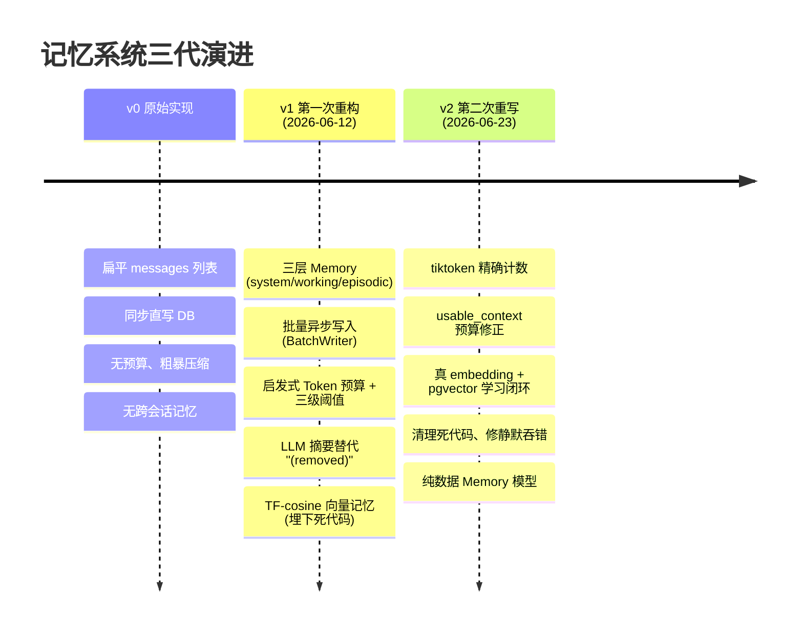
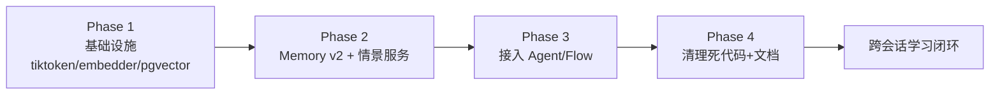
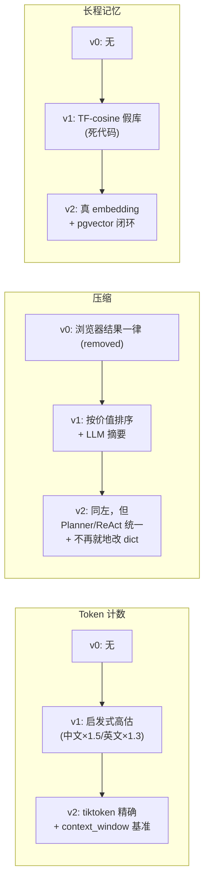

# 记忆系统迭代记录

> 本文记录 Faber 记忆系统从原始实现到当前版本的三代演进，重点讲清「每代做了什么、为什么又推翻、关键决策如何演变」，以及从中沉淀的工程教训。
>
> 关联文档：
> - v1 重构细节：`docs/10-记忆系统重构对比.md`
> - v2 设计稿：`docs/24-记忆系统重设计.md`
> - v2 架构：`docs/25-记忆系统架构.md`

---

## 1. 演进时间线

| 代次 | 时间 | 核心主题 | 结果 |
|---|---|---|---|
| **v0** | 早期 | 把记忆从「无」做成「有」 | 能用，但上下文管理粗糙、无长期记忆 |
| **v1** | 2026-06-12 | 分层 + 预算 + 跨会话检索 | 工作记忆质量提升；**情景记忆整套写成死代码**，埋下技术债 |
| **v2** | 2026-06-23 | 把死代码做活 + 修正错误前提 | 跨会话学习真正闭环；清理债务；结构更干净 |

---

## 2. v0 原始实现：从无到有

**形态**：`Memory.messages` 一个扁平列表，system/user/assistant/tool 全混在一起。

**配套**：
- 每次 add 同步直写 PostgreSQL（一个 ReAct 循环可能写 10+ 次 DB）。
- `compact()` 遍历全部消息，把 `browser_view/browser_navigate` 的结果一律替换成 `"(removed)"`，无论上下文还空不空。
- 没有任何跨会话记忆——每个 session 互不相闻。

**问题**：
- system prompt 与 5 万字符的浏览器 HTML 被同等对待。
- 压缩是「事后补救」，不知道当前用了多少 token。
- `"(removed)"` 让信息彻底丢失，LLM 之后什么都读不到。
- 用户说「像上次那样处理」，AI 毫无历史上下文。

> 这一代的价值是**确立了「记忆」这个一等公民**；代价是几乎所有方面都欠优化。

---

## 3. v1 第一次重构：分层 + 预算（2026-06-12）

详见 `docs/10-记忆系统重构对比.md`。这一代引入了五个组件，显著提升了工作记忆质量，**但也埋下了导致 v2 的几处新债**。

### 3.1 做对的事

| 组件 | 引入内容 | 价值 |
|---|---|---|
| **三层 Memory** | `system_messages` / `working_messages` / `episodic_notes` | system 永不压缩；旧格式自动迁移 |
| **DBMemoryBatchWriter** | asyncio.Queue 攒批 + 去重 + 后台 flush | DB 写入次数 ↓90%，不阻塞 Agent |
| **MemoryBudgetManager** | 70%/85%/95% 三级阈值 + 按价值排序压缩 | 从被动补救变成主动预防 |
| **MemorySummarizer** | 压缩时调 LLM 生成一句话摘要 | 替代 `"(removed)"`，保留关键信息 |

### 3.2 埋下的债（v2 的导火索）

| 债 | 表现 | 后果 |
|---|---|---|
| **情景记忆整套是死代码** | `MemoryRetriever.index_*` 全代码库无人调用；VectorMemory 永远为空；`retrieve_for_*` 恒返回 `[]` | 「跨会话学习」从未发生——这是 v1 最大的承诺落空 |
| **Token 估算刻意高估** | 中文×1.5/英文×1.3 启发式，且拿 `LLM.max_tokens`（实为最大**输出**token）当上下文上限 | 两者叠加 → 压缩过早触发，白白浪费上下文 |
| **静默吞错** | BatchWriter 写失败只打日志就吞掉 | DB 抖动时记忆可能丢失且无人知晓 |
| **TF-cosine 假向量库** | 手搓词频向量 + 余弦，存 Redis Hash，每次 add/search 全量重读 | 慢且语义召回弱；又是「假」的——不是真 embedding |
| **模型与行为耦合** | `_budget_manager` 作为私有字段挂在 `Memory` 数据模型上；`add_message` 靠 `content.startswith("[经验]")` 字符串嗅探路由 | 数据不纯、魔法字符串脆弱 |
| **共享引用陷阱** | `get_messages()` 返回底层 dict 引用，压缩间接改写原数据 | 难维护、易出 bug |
| **路由 bug** | `BaseAgent` 的 retriever 回退竟 new 了一个 `MemoryBudgetManager`（类型错误） | 靠「总能注入 retriever」侥幸掩盖 |

> v1 的教训核心：**「做了」≠「做对了」**。情景记忆的写入库（VectorMemory）搭得很完整，但没有任何调用方把经验写进去——一个永远为空的向量库，和没有向量库，对用户来说没区别。

---

## 4. v2 第二次重写：把死代码做活（2026-06-23）

设计稿见 `docs/24`，架构见 `docs/25`。这次不再修补，而是**从零重写情景记忆这条线**，并顺手清掉 v1 的债务。

### 4.1 为什么是「重写」而不是「继续修」

- 情景记忆的死代码不是「少调一个方法」能补的——它的检索召回（TF-cosine）本身就不可靠，真要做对必须上 embedding + 向量库。
- v1 的多个错误前提（token 高估、max_tokens 当上限、静默吞错）相互交织，逐个修补不如一次性对齐。
- 这是个人项目，允许不考虑向后兼容的历史负债（保留旧格式自动迁移即可）。

### 4.2 四阶段迭代（每阶段独立可交付）

| 阶段 | 交付物 | 解决了什么 |
|---|---|---|
| **Phase 1 基础设施** | tiktoken、`OpenAIEmbedder`、`EpisodicMemoryModel`(pgvector)、仓库+UoW、迁移、`docker-compose`、`context_window` 配置 | 给「真向量召回」铺好底座 |
| **Phase 2 模型与服务** | Memory v2（纯数据/显式分段/深拷贝）、`MemoryCompactor`、`EpisodicMemoryService`、修 logger bug、BatchWriter 重试 | 数据模型干净；压缩正确；**学习闭环服务落地** |
| **Phase 3 接入** | base.py / flow / agent_service / runner / service_dependencies 全链路换新接口；Flow 完成时触发 `index_task` | **补上 v1 缺失的写入路径**——任务完成即学习 |
| **Phase 4 清理** | 删除 `VectorMemory` + `MemoryRetriever`；新增 `docs/25` | 死代码清零，无半成品 |

### 4.3 关键修复对照

| v1 问题 | v2 方案 |
|---|---|
| 情景记忆死代码 | `EpisodicMemoryService.index_task` 任务完成时写 pgvector，真正闭环 |
| TF-cosine 假向量库 | 真 embedding（DashScope/Qwen）+ pgvector HNSW |
| 启发式高估 + max_tokens 当上限 | tiktoken 精确计数 + `usable_context = context_window − max_tokens − 1024` |
| `[经验]` 字符串嗅探 | 按 role 显式分流 + 独立 `add_episodic_note` |
| `_budget_manager` 挂在数据模型 | 压缩外置为 `MemoryCompactor` 服务 |
| `get_messages()` 共享引用 | 返回新列表 + `replace_working` 受控回写 |
| Planner 不走 LLM 摘要压缩 | 两者统一走 `MemoryCompactor` |
| BatchWriter 静默吞错 | 重试 2 次 + ERROR 级别告警 |
| `db_session_repository` logger 未定义 | 补 `logging.getLogger` |
| retriever 回退类型错误 | 移除错误回退 |

---

## 5. 关键决策的三代演进

同一条决策线，看它如何随认知深化而变化：

| 维度 | v0 | v1 | v2 |
|---|---|---|---|
| 记忆结构 | 扁平 list | 三层 | 三层（纯数据，episodic 瞬态不持久化） |
| Token 计数 | 无 | 启发式高估 | tiktoken 精确 |
| 预算基准 | 无 | `max_tokens×0.9`（错） | `context_window − 输出 − 预留` |
| 压缩触发 | 无 | 三级阈值 | 三级阈值（同样的好设计，沿用） |
| 压缩产物 | `(removed)` | LLM 摘要 | LLM 摘要（沿用，但不再就地改 dict） |
| 长程记忆 | 无 | TF-cosine 死代码 | embedding + pgvector 真闭环 |
| 持久化 | 同步直写 | 批量异步（吞错） | 批量异步（重试 + ERROR） |
| 数据模型纯度 | 纯 | 混（挂 budget_manager） | 纯 |

> 注意：v2 **不是全盘推翻 v1**——三级阈值、按价值排序、LLM 摘要、批量异步写入、三层分层思想，这些 v1 做对的设计被完整继承。v2 修正的是 v1 的**错误前提**和**未兑现的承诺**。

---

## 6. 迭代中沉淀的教训

### 6.1 「做了」不等于「做对了」

v1 的情景记忆搭了 VectorMemory + MemoryRetriever 两个完整类、连注入逻辑都写了，唯独没有「写入」调用方。**一个没人写入的存储，等于不存在。** 衡量一个特性是否落地，标准不是「代码写了吗」，而是「端到端跑通了吗」——v2 把验证标准定为「跑两个相似任务，能在 pgvector 看到记录、能召回」。

### 6.2 高估 token 反而有害

v1 选择「宁可高估不可低估」的启发式，看似保守安全，但叠加「拿 max_tokens 当上限」的错误，导致压缩在很空的上下文里就触发，**用「安全」的名义浪费了上下文**。保守要对在正确的基准上——`context_window` 才是真上限，高估只能小幅、不能两个错误相乘。

### 6.3 静默吞错是慢性毒药

BatchWriter 为了「不打断 Agent」吞掉写错，短期省事，长期让记忆写入变成「可能默默丢失」。v2 改成重试 + ERROR 告警——**宁可吵闹，不可沉默**。容错不是「假装没发生」，而是「失败可见、可重试、可降级」。

### 6.4 技术债有复利

v1 的债不是孤立的：死代码（情景记忆）+ 错误前提（token/上限）+ 耦合（模型挂行为）+ 脆弱（字符串嗅探）相互交织，单点修补收益低。这就是为什么 v2 选择一次性重写情景记忆这条线，而不是继续打补丁。**债攒到一定密度，重写比修补更省。**

### 6.5 数据模型要保持纯净

把 `budget_manager` 挂在 `Memory` 上是 v1 的结构性失误——数据模型承担了行为，序列化时要特判、迁移时要重挂。v2 让 `Memory` 只承载数据，压缩交给 `MemoryCompactor`，一切清爽。

---

## 7. 后续迭代方向（v3+ 候选）

v2 让跨会话学习跑通，但只是「能用」，离「好用」还有空间。按优先级：

| 方向 | 现状 | 迭代思路 |
|---|---|---|
| **经验淘汰** | 只增不删，`prune` 接口已留但未调度 | 按 `importance × recency × use_count` 定期淘汰低价值经验，防库膨胀 |
| **重要性衰减** | `importance` 写入后不变 | 引入时间衰减：长期未被召回的经验重要性递减 |
| **召回 rerank** | pgvector 纯向量召回 top-k | 召回后用轻量 rerank（或 LLM 判定）提升相关性，过滤误召回 |
| **多 Agent 共享记忆** | planner/react 各自独立 episodic | 引入 `global` scope：跨 Agent 共享通用经验 |
| **增量 / 去重索引** | 每个任务结束都写入 | 写入前 embedding 近邻查重，避免近似经验重复沉淀 |
| **评估体系** | 无量化指标 | 构造任务集，量化「召回命中率」「压缩后任务成功率」，让迭代有据可依 |
| **Token 计数 provider API** | tiktoken（对 DeepSeek 近似） | 优先用 provider 官方 token-counting 接口（若可用），tiktoken 兜底 |
| **记忆可视化** | 只能查 DB | 前端展示 episodic 库、压缩前后对比、预算曲线，便于调试 |

---

## 8. 版本快照

- **v0**：`Memory.messages` 扁平 + 同步直写 + 无预算。已随 v1 替换。
- **v1**（2026-06-12）：三层 Memory + BatchWriter + 启发式预算 + LLM 摘要 + TF-cosine 向量记忆（死代码）。详见 `docs/10`。
- **v2**（2026-06-23）：tiktoken + `usable_context` + MemoryCompactor + embedding/pgvector 学习闭环 + 死代码清理 + 静默吞错修复。详见 `docs/24`（设计）/ `docs/25`（架构）。

---

*记录时间：2026-06-23*
